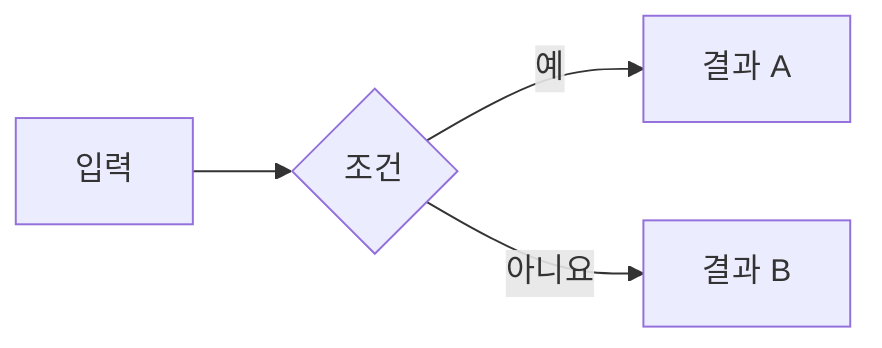

# Soopace

Astro 기반 개인 연구 포트폴리오 및 블로그입니다.

## Requirements

- Node.js `>=22.12.0`
- 이 저장소의 권장 Node 버전은 `.nvmrc`에 적혀 있습니다.

`nvm`이 없는 환경에서는 `node -v`로 현재 버전을 확인하고, Node 22.12 이상을 설치한 뒤 진행하세요.

## Development

의존성 설치:

```bash
npm install
```

개발 서버 실행:

```bash
npm run dev
```

또는 로컬 실행 스크립트를 사용합니다. `node_modules/`가 없으면 의존성도 자동으로 설치합니다.

```bash
./scripts/serve.sh
```

다른 포트를 사용하려면 포트 번호를 인자로 전달합니다.

```bash
./scripts/serve.sh 4322
```

기본 주소:

```text
http://localhost:4321/
```

이미 `4321` 포트가 사용 중이면 Astro가 다음 포트로 자동 실행합니다. 예를 들어 `4322`로 뜨면 아래 주소로 접속하면 됩니다.

```text
http://localhost:4322/
```

## Build

정적 사이트 빌드:

```bash
npm run build
```

빌드 결과는 `dist/`에 생성됩니다.

## Notes writing conventions

- 중요한 전문 용어는 글에서 처음 등장할 때 `한글(영어)`로 표기합니다. 예: `자기정보량(self-information)`.
- 약어가 중요하면 `한글(영어 원문, 약어)`까지 함께 씁니다. 예: `음의 로그 가능도(negative log-likelihood, NLL)`.
- 절 제목과 핵심 용어 표에서는 독자가 원문 용어를 바로 찾을 수 있도록 한글과 영어를 함께 씁니다.
- 한 번 정의한 용어는 이후 문장에서 한글 또는 약어로 줄여 써서 본문이 지나치게 무거워지지 않게 합니다.

## Mermaid diagrams

Markdown 글에서는 `mermaid` 코드 블록으로 다이어그램을 작성할 수 있습니다.

````markdown

````

Mermaid는 해당 코드 블록이 있는 페이지에서만 동적으로 불러옵니다. 일반 코드 블록은 기존 코드 하이라이팅을 그대로 사용합니다.

## Research Page Toggle

연구 페이지 노출 여부는 아래 파일에서 조정합니다.

```text
src/research.config.yaml
```

예:

```yaml
projects:
  trace2map: true
  nl2sql-plus: false
```
