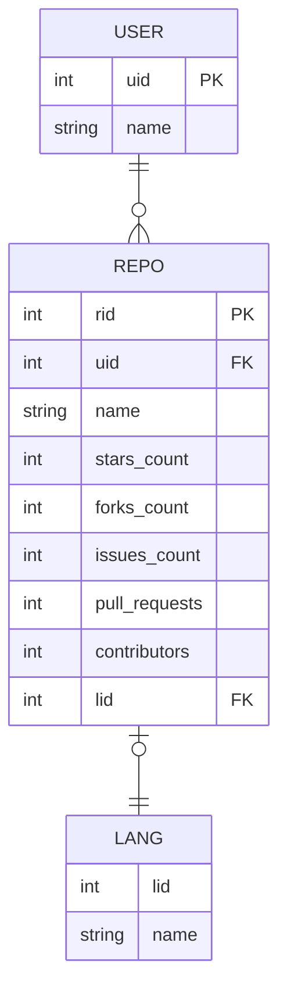

<figure markdown>
  { class="skipglightbox" width="100%" }
  <figcaption>Reference: MongoDB</figcaption>
</figure>

GitHub Dataset[^1]를 사용하여 데이터 모델링을 실습해본다. 기존의 RDBMS의 디자인이라면 다음과 같다.

[^1]: [Kaggle-GitHub Dataset Version 1](https://www.kaggle.com/datasets/nikhil25803/github-dataset)

- GitHub 사용자 테이블(USER): 한 명의 사용자는 여러 개의 repository를 만들 수 있다.
- GitHub Repository 테이블(REPO): Repository이름 등 정보와 주 작성언어(없을 수도 있음)를 기록한다.
- Language 테이블(LANG): 작성언어 



NoSQL로는 다음과 같이 하나의 도큐먼트로 만들 수 있다.

``` javascript title="document"
{
    _id: REPO_RID,
    user: USER_NAME,
    name: REPO_NAME,
    stars_count: REPO_STARS_COUNT,
    forks_count: REPO_FORKS_COUNT,
    issues_count: REPO_ISSUES_COUNT,
    pull_requests: REPO_PULL_REQUESTS,
    contributors: REPO_CONTRIBUTORS,
    language: LANG_NAME,
}
```

## Create Database

이번에는 MongDB Compass로 여러 작업을 수행해보도록 하겠다. 우선 데이터베이스 `github`라는 데이터베이스와 `repo`라는 컬렉션을 만들고 데이터를 불러오자.

=== "Create DB 1"

    { align=left width=30% }

    MongoDB Compass 좌측 상단에서 `+`를 눌러 새로운 데이터 베이스를 생성하자.

=== "Create DB 2"

    { align=left width=50% }

    새로운 데이터 베이스 이름을 지어주자 Database Name은 `github` Collection Name은 `repo`로 한다.

=== "Create DB 3"
    
    { align=left width=30% }

    좌측 패널에 데이터베이스가 생기면서 컬렉션도 같이 만들어 졌다.

{ align=right width=40% }

## Load Data from CSV file

`repo` collection을 클린한 후에 중앙에 `Import Data`를 눌러서 데이터를 불러오자. 이번 실습에 필요한 데이터는 [여기](https://github.com/simonjisu/bkms2_2023spring/blob/59d5e7b8e7268c623e9950ffef8a31c7d3e916a7/00_mongodb/datasets/github/github.csv)에서 다운 받을 수 있다. 데이터를 불러오면 우측과 같은 화면이 보이는데, 여기서 스키마 설정을 함께 할 수 있다.
문자열 타입인 `String`을 제외하고는 대부분 숫자형인 `Number` 타입을 설정하면 된다. `Number` 타입은 "number", "int", "long", "double", "decimal" 을 포함한다. 자세한 내용은 공식문서 스키마를 참고하길 바란다. [^2]

[^2]: [MongoDB - Schemas](https://www.mongodb.com/docs/atlas/app-services/schemas/)

<br>

## Query API 

이제 불러온 도큐먼트들을 쿼리 해볼 시간이다. MongoDB Compass 제일 하단에 있는 `mongosh`를 눌러서 쉘을 실행시키자

=== "Example 1"

    > 총 유저의 수는 어떻게 될까?

    - `distinct` 메소드로 필드의 중복된 데이터를 걸러낼 수 있다.
    - `length` 속성은 배열의 길이를 반환한다.

    ```bash
    > db.repo.distinct('user_name').length
    ```

=== "Example 2"

    > `stars_count`가 10개 이상 인 유저는 몇 명 일까?

    - `countDocuments` 메서드로 쿼리조건의 해당하는 도큐먼트의 개수를 셀 수 있다.
    - `$gte` 연산자로 x보다 큰 연산을 수행할 수 있다. 

    ```bash
    > db.repo.countDocuments({ 'stars_count': { $gte: 10 } })
    ```

=== "Example 3"

    > 총 유저 별로 만든 repository는 몇 개 일까? 상위 10개만 뽑아보자.

    - `$group` 연산자로 aggregation을 수행할 수 있다.

    ```bash
    ```

    - `$filter` 연산자로 필터링을 수행할 수 있다.


## Aggregation Pipeline

## Indexing