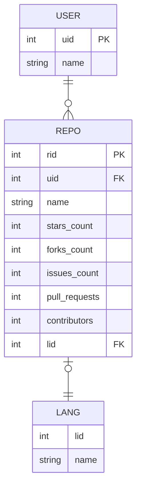

GitHub Dataset[^1]를 사용하여 데이터 모델링을 실습해본다. 기존의 RDBMS의 디자인이라면 다음과 같다.

[^1]: [Kaggle-GitHub Dataset Version 1](https://www.kaggle.com/datasets/nikhil25803/github-dataset)

- GitHub 사용자 테이블(USER): 한 명의 사용자는 여러 개의 repository를 만들 수 있다.
- GitHub Repository 테이블(REPO): Repository이름 등 정보와 주 작성언어(없을 수도 있음)를 기록한다.
- Language 테이블(LANG): 작성언어 



NoSQL로는 다음과 같이 하나의 도큐먼트로 만들 수 있다.

``` javascript title="document"
{
    _id: REPO_RID,
    user: USER_NAME,
    name: REPO_NAME,
    stars_count: REPO_STARS_COUNT,
    forks_count: REPO_FORKS_COUNT,
    issues_count: REPO_ISSUES_COUNT,
    pull_requests: REPO_PULL_REQUESTS,
    contributors: REPO_CONTRIBUTORS,
    language: LANG_NAME,
}
```
