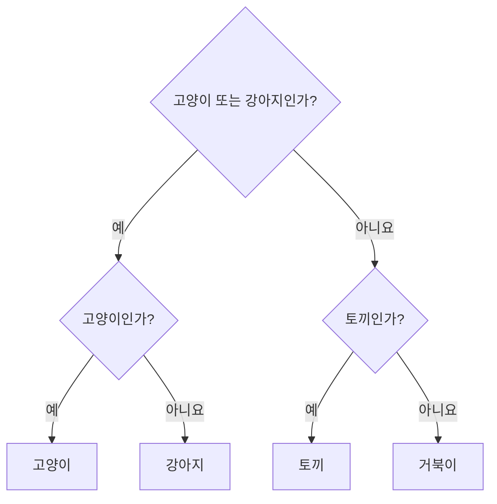
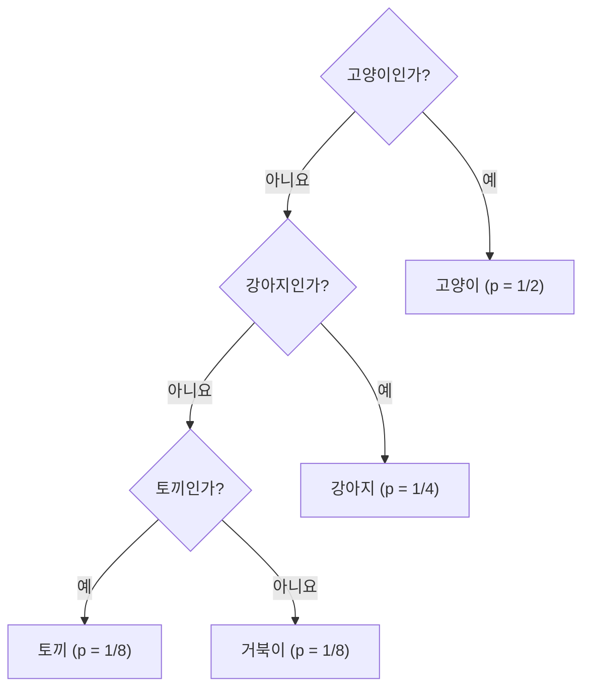

<p class="ai-assisted-disclosure">이 글은 AI의 도움을 받아 작성되었습니다.</p>

[← Information Theory 학습 커리큘럼](/notes/info/curriculum/)

# Chapter 1. 정보란 무엇인가

> 스무고개에서 다음 토큰 예측까지

## 이 장에서 배울 것

우리는 매일 수많은 정보를 주고받는다. 메시지를 읽고, 날씨를 확인하고, 검색 결과를 살펴본다. 하지만 “정보가 얼마나 들어 있는가?”라고 물으면 답하기가 쉽지 않다. 문장이 길면 정보도 많은 것일까? 중요한 소식일수록 정보량이 큰 것일까? 이미 알고 있던 사실도 정보라고 부를 수 있을까?

정보이론(information theory)은 메시지의 의미나 중요도를 직접 측정하지 않는다. 대신 어떤 사건이 일어날 가능성과 그 사건을 관측했을 때 줄어드는 불확실성에 주목한다.

이 장을 마치면 다음을 할 수 있다.

- 데이터(data), 의미(semantics), 샤논 정보량(Shannon information)의 차이를 설명한다.
- 비트(bit)를 “0 또는 1을 저장하는 칸”뿐 아니라 “이진 질문의 수”로 해석한다.
- 사건의 확률로 자기정보량(self-information)을 계산한다.
- 정보량의 단위인 비트(bit)와 내트(nat)의 차이를 설명한다.
- 언어 모델이 정답 토큰에 부여한 확률로 토큰 손실(token loss)을 계산한다.
- 자기정보량과 엔트로피(entropy)를 구분한다.

### 핵심 용어 표기

| 한글 용어 | 영어 원문 | 이 장에서의 뜻 |
|---|---|---|
| 정보이론 | information theory | 확률과 불확실성을 이용해 정보의 양을 다루는 이론 |
| 확률모형 | probability model | 가능한 사건과 각 사건의 확률을 정한 모형 |
| 샤논 정보량 | Shannon information | 확률모형 아래에서 관측한 사건의 놀라움을 나타내는 양 |
| 자기정보량 | self-information | 특정 사건 하나를 관측했을 때 얻는 정보량 |
| 놀라움 | surprisal | 자기정보량을 강조해 부르는 다른 이름 |
| 비트 | bit | 밑이 2인 로그를 사용할 때의 정보량 단위 |
| 내트 | nat | 자연로그를 사용할 때의 정보량 단위 |
| 토큰 손실 | token loss | 모델이 정답 토큰에 부여한 확률의 음의 로그 |
| 엔트로피 | entropy | 관측 전 확률분포가 가진 평균 불확실성 |

---

## 1.1 정보가 많다는 말은 무슨 뜻일까

다음 두 메시지를 비교해 보자.

> 메시지 A: 내일도 해는 동쪽에서 뜬다.

> 메시지 B: 내일 서울에 8월의 첫눈이 내린다.

두 문장의 길이는 비슷하다. 하지만 대부분의 사람은 메시지 B에서 훨씬 많은 정보를 얻었다고 느낀다. 메시지 A는 이미 거의 확실하게 예상한 내용이고, 메시지 B는 예상하기 어려운 내용이기 때문이다.

이번에는 다음 두 문자열을 보자.

```text
0000000000000000
0110100011010110
```

두 문자열은 모두 16개의 비트로 적혀 있다. 저장 공간만 보면 크기가 같다. 그러나 첫 번째 문자열은 “0이 16번 반복된다”라는 짧은 규칙으로 설명할 수 있다. 두 번째 문자열에는 눈에 띄는 규칙이 없다.

여기서 서로 다른 세 가지 개념이 드러난다.

1. **데이터의 크기**: 메시지를 저장하거나 전송할 때 차지하는 공간
2. **의미와 중요도**: 사람이 메시지를 읽고 부여하는 해석과 가치
3. **샤논 정보량(Shannon information)**: 확률모형(probability model) 아래에서 사건이 얼마나 예상 밖인지 나타내는 양

이 책에서 “정보량”이라고 부르는 것은 특별한 설명이 없는 한 세 번째 개념이다. 따라서 드문 사건은 샤논 정보량이 크지만, 반드시 중요하거나 유익한 사건인 것은 아니다. 무작위로 생성한 의미 없는 문자열도 충분히 예상하기 어렵다면 큰 정보량을 가질 수 있다.

> **핵심 구분**
>
> 정보이론은 “이 메시지가 인간에게 얼마나 중요한가?”보다 “이 메시지가 관측되기 전에 얼마나 예측하기 어려웠는가?”를 묻는다.

---

## 1.2 스무고개와 1 비트(bit)

친구가 다음 네 동물 가운데 하나를 마음속으로 골랐다고 하자.

```text
고양이  강아지  토끼  거북이
```

네 동물이 선택될 가능성은 모두 같고, 우리는 “예” 또는 “아니요”로 답할 수 있는 질문만 할 수 있다.

좋은 첫 질문은 후보를 절반으로 나눈다.

> 질문 1: 선택한 동물은 고양이 또는 강아지인가?

대답이 “예”라면 후보는 고양이와 강아지로 줄어든다. 이제 질문 하나면 충분하다.

> 질문 2: 선택한 동물은 고양이인가?

두 번의 질문으로 네 후보 가운데 하나를 정확히 찾았다. 이 과정을 이진 결정 트리(binary decision tree)로 쓰면 다음과 같다.



*그림 1. 같은 확률의 네 동물을 찾는 균형 잡힌 이진 질문 트리.*

예 또는 아니요로 답하는 균형 잡힌 질문 하나가 제공하는 정보의 양을 **1 비트(bit)**라고 생각할 수 있다.

- 후보가 2개라면 질문 1번이 필요하다.
- 후보가 4개라면 질문 2번이 필요하다.
- 후보가 8개라면 질문 3번이 필요하다.
- 후보가 16개라면 질문 4번이 필요하다.

후보 수를 $N$, 필요한 이진 질문 수를 $k$라고 하면 다음 관계가 성립한다.

$$
N=2^k
$$

따라서 필요한 질문 수는 다음과 같다.

$$
k=\log_2 N
$$

이 식은 정보이론에 로그가 등장하는 첫 번째 이유를 보여 준다. 구분해야 할 후보가 두 배가 될 때마다 필요한 질문이 하나씩 늘어난다.

### 후보의 확률이 서로 다르다면

이번에는 네 동물의 선택 확률이 다음과 같다고 하자.

| 동물 | 선택 확률 |
|---|---:|
| 고양이 | $1/2$ |
| 강아지 | $1/4$ |
| 토끼 | $1/8$ |
| 거북이 | $1/8$ |

이 경우 모든 동물에 똑같이 두 번씩 질문하는 전략이 반드시 최선은 아니다. 가장 자주 선택되는 고양이는 한 번의 질문으로 확인하고, 드문 동물에는 더 많은 질문을 사용할 수 있다.



*그림 2. 확률이 서로 다른 네 동물을 찾는 비대칭 질문 트리. 자주 선택되는 동물일수록 적은 질문으로 찾는다.*

이 트리에서 필요한 질문 수는 다음과 같다.

| 동물 | 확률 | 질문 수 |
|---|---:|---:|
| 고양이 | $1/2$ | 1 |
| 강아지 | $1/4$ | 2 |
| 토끼 | $1/8$ | 3 |
| 거북이 | $1/8$ | 3 |

확률이 절반으로 줄어들 때마다 질문이 하나씩 늘어난다. 이 관계를 식으로 나타내면 곧 자기정보량(self-information)의 정의가 된다.

---

## 1.3 놀라움(surprisal)을 수로 만들기

어떤 사건 $x$가 일어날 확률을 $p(x)$라고 하자. 우리는 사건 $x$를 관측했을 때 얻는 정보량을 $I(x)$로 나타내고 싶다.

좋은 정보량 함수는 적어도 다음 세 가지 조건을 만족해야 한다.

### 조건 1. 드문 사건일수록 정보량이 커야 한다

매일 일어나는 사건보다 거의 일어나지 않는 사건을 관측했을 때 더 많이 놀란다. 따라서 $p(x)$가 작아질수록 $I(x)$는 커져야 한다.

### 조건 2. 확실한 사건의 정보량은 0이어야 한다

반드시 일어날 사건을 관측해도 새로 알게 된 것은 없다. 따라서 다음을 원한다.

$$
I(x)=0 \quad \text{if} \quad p(x)=1
$$

### 조건 3. 독립 사건(independent events)의 정보량은 더해져야 한다

독립인 두 사건 $x$와 $y$가 함께 일어날 확률은 두 확률의 곱이다.

$$
p(x,y)=p(x)p(y)
$$

두 사건을 차례로 관측해 얻는 전체 정보량은 각각의 정보량을 더한 값이기를 원한다.

$$
I(x,y)=I(x)+I(y)
$$

즉, 확률의 곱을 정보량의 합으로 바꾸는 함수가 필요하다. 로그는 정확히 이 성질을 갖는다.

$$
\log(ab)=\log a+\log b
$$

연속성처럼 자연스러운 조건을 함께 요구하면 이 성질들을 만족하는 함수는 로그 형태로 정해진다. 다만 확률은 0과 1 사이에 있으므로 $\log p(x)$는 0 이하가 된다. 정보량을 0 이상의 값으로 만들기 위해 마이너스 부호를 붙인다.

$$
I(x)=-\log_2 p(x)
$$

이 값을 사건 $x$의 **자기정보량(self-information)**, **정보 내용(information content)**, 또는 **놀라움(surprisal)**이라고 부른다. 이 책에서는 주로 자기정보량이라는 용어를 사용한다.

---

## 1.4 자기정보량(self-information) 계산하기

확률이 $1/2$인 사건의 자기정보량부터 계산해 보자.

$$
I(x)=-\log_2 \frac{1}{2}=1 \text{ bit}
$$

확률이 $1/4$이면 다음과 같다.

$$
I(x)=-\log_2 \frac{1}{4}=2 \text{ bit}
$$

확률이 $1/8$이면 다음과 같다.

$$
I(x)=-\log_2 \frac{1}{8}=3 \text{ bit}
$$

| 사건의 확률 $p(x)$ | 자기정보량 $I(x)$ | 질문으로 해석하기 |
|---:|---:|---|
| $1$ | $0$ bit | 질문할 필요가 없다 |
| $1/2$ | $1$ bit | 이진 질문 1번 |
| $1/4$ | $2$ bit | 이진 질문 2번 |
| $1/8$ | $3$ bit | 이진 질문 3번 |
| $1/16$ | $4$ bit | 이진 질문 4번 |
| $1/1024$ | $10$ bit | 이진 질문 10번 |

### 예제 1. 공정한 동전

공정한 동전에서 앞면이 나올 확률은 $1/2$다. 앞면을 관측했을 때의 자기정보량은 다음과 같다.

$$
I(\text{앞면})=-\log_2 \frac{1}{2}=1 \text{ bit}
$$

뒷면도 마찬가지로 1 bit다.

### 예제 2. 치우친 동전

앞면이 나올 확률이 $0.9$이고 뒷면이 나올 확률이 $0.1$인 동전을 생각하자.

앞면의 자기정보량은 다음과 같다.

$$
I(\text{앞면})=-\log_2 0.9 \approx 0.152 \text{ bit}
$$

뒷면의 자기정보량은 다음과 같다.

$$
I(\text{뒷면})=-\log_2 0.1 \approx 3.322 \text{ bit}
$$

두 결과 모두 동전 한 번의 결과지만 정보량은 다르다. 예상하기 쉬운 앞면은 적은 정보를 주고, 드문 뒷면은 많은 정보를 준다.

### 예제 3. 공정한 주사위

공정한 주사위에서 특정 눈 하나가 나올 확률은 $1/6$이다. 6이 나왔을 때의 자기정보량은 다음과 같다.

$$
I(6)=-\log_2 \frac{1}{6}=\log_2 6\approx 2.585 \text{ bit}
$$

결과가 여섯 개인데 왜 정수가 아닌 2.585비트가 나올까? 한 번의 주사위 결과만을 고정 길이 이진 코드로 표현하려면 실제로는 3비트가 필요하다. 하지만 같은 주사위를 여러 번 던진 결과를 한꺼번에 효율적으로 부호화(encoding)하면 결과 하나당 평균 길이를 $\log_2 6$비트에 가깝게 만들 수 있다. 이 연결은 압축을 다루는 장에서 자세히 살펴본다.

### 예제 4. 독립 사건(independent events) 두 개

독립인 사건 $A$와 $B$의 확률이 각각 다음과 같다고 하자.

$$
p(A)=\frac{1}{4}, \qquad p(B)=\frac{1}{8}
$$

두 사건이 동시에 일어날 확률은 다음과 같다.

$$
p(A,B)=\frac{1}{4}\times\frac{1}{8}=\frac{1}{32}
$$

동시 사건의 자기정보량을 직접 계산하면 다음과 같다.

$$
I(A,B)=-\log_2\frac{1}{32}=5 \text{ bit}
$$

각 사건의 자기정보량을 더해도 같은 결과를 얻는다.

$$
I(A)+I(B)=2+3=5 \text{ bit}
$$

이 예제는 로그를 사용한 덕분에 독립 사건의 확률 곱셈이 정보량의 덧셈으로 바뀐다는 사실을 보여 준다.

---

## 1.5 확률이 0이면 어떻게 될까

자기정보량 식에 $p(x)=0$을 넣으면 다음과 같은 극한을 생각하게 된다.

$$
\lim_{p(x)\to 0^+}-\log_2 p(x)=\infty
$$

확률이 0에 가까울수록 그 사건의 자기정보량은 한없이 커진다. 확률이 정확히 0이라는 말은 확률모형이 그 사건을 불가능하다고 선언했다는 뜻이다. 그런데 실제로 그 사건이 관측되면 기존 모형으로는 설명할 수 없다.

이 성질은 확률모형을 만들 때 중요한 경고가 된다. 데이터에서 한 번도 보지 못한 사건이라고 해서 실제 확률이 반드시 0인 것은 아니다. 단순히 표본이 부족했을 수도 있다.

언어 모델(language model)에서도 정답 토큰에 정확히 0의 확률을 부여하면 손실(loss)이 무한대로 발산한다.

$$
-\log 0=\infty
$$

실제 신경망의 소프트맥스(softmax)는 이상적인 실수 연산에서 각 토큰에 양의 확률을 부여하지만, 수치 표현의 한계나 부적절한 구현 때문에 0으로 반올림되는 문제는 생길 수 있다. 그래서 실제 코드는 확률을 먼저 계산한 뒤 로그를 취하기보다 안정적으로 구현된 로그 소프트맥스(log-softmax)를 사용한다.

---

## 1.6 비트(bit)와 내트(nat)

로그의 밑에 따라 정보량의 단위가 달라진다.

### 밑이 2인 로그: 비트(bit)

$$
I_2(x)=-\log_2 p(x)
$$

밑이 2이면 단위는 비트다. 이진 질문의 수 또는 이진 부호 길이(binary code length)와 연결하기 좋다.

### 자연로그(natural logarithm): 내트(nat)

$$
I_e(x)=-\ln p(x)
$$

자연로그를 사용하면 단위는 내트다. 미적분과 최적화에서는 자연로그가 편리하므로 머신러닝 라이브러리의 교차 엔트로피(cross-entropy)와 음의 로그 가능도(negative log-likelihood, NLL)는 보통 내트 단위를 사용한다.

같은 사건을 다른 단위로 표현할 뿐이므로 두 값은 상수배 관계다.

$$
1 \text{ nat}=\log_2 e \text{ bit}\approx 1.443 \text{ bit}
$$

$$
1 \text{ bit}=\ln 2 \text{ nat}\approx 0.693 \text{ nat}
$$

예를 들어 확률이 $1/2$인 사건은 1비트의 정보를 갖는다. 내트로 나타내면 다음과 같다.

$$
-\ln\frac{1}{2}=\ln 2\approx 0.693 \text{ nat}
$$

> **단위 확인 습관**
>
> 수식에 $\log$만 적혀 있다면 로그의 밑을 확인하자. 밑을 모르면 결과가 비트인지 내트인지 알 수 없다.

---

## 1.7 자기정보량(self-information)과 코드 길이(code length)

자기정보량은 사건을 구분하는 데 필요한 이상적인 이진 질문 수로 해석할 수 있다. 동시에 그 사건을 표현하는 이상적인 이진 코드 길이로도 해석할 수 있다.

앞에서 사용한 동물 분포를 다시 보자.

| 동물 | 확률 | 코드 | 코드 길이 | 자기정보량 |
|---|---:|---:|---:|---:|
| 고양이 | $1/2$ | `0` | 1 | 1 bit |
| 강아지 | $1/4$ | `10` | 2 | 2 bit |
| 토끼 | $1/8$ | `110` | 3 | 3 bit |
| 거북이 | $1/8$ | `111` | 3 | 3 bit |

이 예제에서는 각 사건의 코드 길이가 자기정보량과 정확히 일치한다.

$$
\ell(x)=-\log_2 p(x)
$$

이처럼 확률이 $2^{-k}$ 꼴이면 자기정보량이 정수 $k$가 되어 코드 길이와 깔끔하게 맞아떨어진다. 일반적인 확률에서는 자기정보량이 정수가 아닐 수 있으므로 사건 하나만 따로 부호화할 때 정확히 같은 길이의 코드를 만들 수는 없다. 그러나 긴 사건열을 함께 부호화하면 평균 코드 길이를 이론적 한계에 가깝게 만들 수 있다.

이 관점은 중요한 원리를 알려 준다.

> 자주 일어나는 사건에는 짧은 코드를, 드물게 일어나는 사건에는 긴 코드를 배정하라.

모스 부호(Morse code)에서 자주 등장하는 영문자 `E`가 짧은 부호를 갖고, 허프먼 부호화(Huffman coding)가 빈도에 따라 코드 길이를 다르게 정하는 것도 같은 생각을 따른다.

---

## 1.8 언어 모델은 다음 토큰을 얼마나 놀라워했을까

언어 모델은 지금까지의 토큰(token)이 주어졌을 때 다음 토큰 분포(next-token distribution)를 출력한다. 토큰 시퀀스(token sequence)를 $x_1,x_2,\ldots,x_T$라고 하면, 시점 $t$의 모델은 다음 분포를 예측한다.

$$
q(x_t\mid x_1,\ldots,x_{t-1})
$$

앞부분 $x_1,\ldots,x_{t-1}$을 간단히 $x_{<t}$라고 쓰면 다음과 같다.

$$
q(x_t\mid x_{<t})
$$

여기서 $q$는 언어 모델이 추정한 분포다. 실제로 관측된 정답 토큰이 $x_t$라면 이 토큰의 **토큰 손실(token loss)**은 모델이 정답에 부여한 확률의 음의 로그다.

$$
\mathcal{L}_t=-\log q(x_t\mid x_{<t})
$$

이 식은 자기정보량과 같은 모양이다. 차이는 우리가 현실의 참된 확률 $p$를 정확히 안다고 가정하지 않고, 모델이 예측한 분포 $q$를 사용한다는 점이다.

### 작은 다음 토큰 모델(toy next-token model)

문맥이 다음과 같다고 하자.

> 오늘 점심으로 김치

작은 언어 모델(toy language model)이 다음 토큰에 아래 확률을 부여했다.

| 다음 토큰 | 모델 확률 |
|---|---:|
| 찌개 | $0.50$ |
| 볶음밥 | $0.25$ |
| 우동 | $0.125$ |
| 위성 | $0.125$ |

확률의 합은 1이다.

$$
0.50+0.25+0.125+0.125=1
$$

정답이 `찌개`라면 비트 단위 손실은 다음과 같다.

$$
\mathcal{L}_t=-\log_2 0.50=1 \text{ bit}
$$

정답이 `볶음밥`이라면 다음과 같다.

$$
\mathcal{L}_t=-\log_2 0.25=2 \text{ bit}
$$

정답이 `위성`이라면 다음과 같다.

$$
\mathcal{L}_t=-\log_2 0.125=3 \text{ bit}
$$

관측된 토큰은 언제나 하나지만, 모델이 그 토큰을 얼마나 예상했는지에 따라 손실이 달라진다. 모델이 정답 토큰에 높은 확률을 주면 손실이 작고, 낮은 확률을 주면 손실이 크다.

### 두 모델 비교하기

같은 정답 토큰에 모델 A가 $0.8$, 모델 B가 $0.2$의 확률을 주었다고 하자.

$$
\mathcal{L}_A=-\log_2 0.8\approx 0.322 \text{ bit}
$$

$$
\mathcal{L}_B=-\log_2 0.2\approx 2.322 \text{ bit}
$$

모델 B의 손실이 정확히 2비트 더 크다.

$$
\mathcal{L}_B-\mathcal{L}_A
=-\log_2 0.2+\log_2 0.8
=\log_2\frac{0.8}{0.2}
=2 \text{ bit}
$$

모델 A는 정답 토큰을 모델 B보다 4배 높은 확률로 예상했다. 확률비가 4배라는 사실이 2비트 차이로 표현된다.

### 시퀀스(sequence) 전체의 손실(loss)

언어 모델은 문장 전체의 확률을 각 시점의 조건부확률의 곱으로 나타낸다.

$$
q(x_1,\ldots,x_T)=\prod_{t=1}^{T}q(x_t\mid x_{<t})
$$

문장 전체의 음의 로그 가능도(negative log-likelihood, NLL)는 다음과 같다.

$$
-\log q(x_1,\ldots,x_T)
=-\log\prod_{t=1}^{T}q(x_t\mid x_{<t})
$$

로그가 곱을 합으로 바꾸므로 다음과 같이 토큰별 손실의 합이 된다.

$$
-\log q(x_1,\ldots,x_T)
=\sum_{t=1}^{T}-\log q(x_t\mid x_{<t})
$$

이 성질 덕분에 언어 모델은 문장 전체의 확률을 직접 하나의 거대한 표로 다루지 않고, 다음 토큰 예측 문제의 연속으로 학습할 수 있다.

> **주의**
>
> 모델의 토큰 손실(token loss)이 작다는 사실은 그 모델이 문장의 의미를 인간처럼 이해한다는 것을 직접 보장하지 않는다. 이 값은 주어진 토큰화(tokenization)와 평가 데이터에서 정답 토큰을 얼마나 높은 확률로 예측했는지를 측정한다.

---

## 1.9 한 사건의 정보에서 분포의 불확실성으로

자기정보량 $I(x)$는 실제로 관측된 사건 하나의 놀라움을 나타낸다. 그러나 동전을 던지기 전에는 앞면과 뒷면 중 무엇이 나올지 모른다. 관측 전에 분포 전체가 얼마나 불확실한지 측정하려면 가능한 모든 결과의 자기정보량을 평균해야 한다.

확률변수(random variable) $X$가 값 $x$를 가질 확률을 $p(x)$라고 하자. 자기정보량의 기댓값(expectation)은 다음과 같다.

$$
\mathbb{E}[I(X)]
=\sum_x p(x)I(x)
$$

$I(x)=-\log_2p(x)$를 대입하면 다음 식을 얻는다.

$$
H(X)
=-\sum_x p(x)\log_2p(x)
$$

이 값을 확률변수 $X$의 **엔트로피(entropy)**라고 부른다.

자기정보량과 엔트로피의 차이를 분명히 하자.

| 개념 | 질문 | 대상 |
|---|---|---|
| 자기정보량 $I(x)$ | 실제로 일어난 사건 $x$는 얼마나 놀라운가? | 사건 하나 |
| 엔트로피 $H(X)$ | 관측하기 전 분포 $X$는 평균적으로 얼마나 불확실한가? | 확률분포 전체 |

공정한 동전은 앞면과 뒷면이 각각 1 bit의 자기정보량을 갖는다. 어느 쪽이 나오더라도 1 bit를 얻으므로 평균도 1 bit다.

$$
H(X)
=-\frac{1}{2}\log_2\frac{1}{2}
-\frac{1}{2}\log_2\frac{1}{2}
=1 \text{ bit}
$$

반면 앞면 확률이 $0.9$인 동전은 대부분 예상한 앞면이 나온다. 가끔 큰 놀라움을 주는 뒷면이 나오지만, 평균 불확실성은 공정한 동전보다 작다.

$$
H(X)
=-0.9\log_2 0.9-0.1\log_2 0.1
\approx 0.469 \text{ bit}
$$

엔트로피의 의미와 성질은 Chapter 3에서 자세히 다룬다. 그 전에 Chapter 2에서 확률변수, 결합확률(joint probability), 조건부확률(conditional probability)을 정리한다.

---

## 1.10 자주 하는 오해

### 오해 1. 긴 메시지는 항상 정보량이 크다

메시지 길이와 샤논 정보량(Shannon information)은 같지 않다. 긴 메시지도 매우 예측 가능하면 적은 정보만 줄 수 있다. 반대로 짧은 메시지도 매우 드문 사건을 알리면 큰 정보량을 줄 수 있다.

### 오해 2. 중요한 사건일수록 정보량이 크다

샤논 정보량은 중요도를 측정하지 않는다. 사건의 확률만 사용한다. 일상적으로 중요한 사건과 정보이론적으로 놀라운 사건이 겹칠 수는 있지만, 두 개념은 동일하지 않다.

### 오해 3. 확률이 작은 사건은 반드시 복잡하다

확률은 반드시 사건 자체의 복잡성만으로 정해지지 않는다. 어떤 확률모형을 사용했는지에 따라 같은 사건의 정보량이 달라진다.

$$
I_p(x)=-\log p(x)
$$

모형 $p$가 달라지면 $I_p(x)$도 달라진다.

### 오해 4. 비트(bit)는 저장장치에서만 사용하는 단위다

비트는 이진 숫자 하나를 저장하는 물리적 공간을 가리킬 수 있지만, 정보이론에서는 불확실성을 절반으로 줄이는 이상적인 이진 질문 한 번의 정보량으로 해석할 수 있다.

### 오해 5. 토큰 손실(token loss)은 언제나 비트(bit) 단위다

로그의 밑이 2일 때만 비트 단위다. 대부분의 머신러닝 구현은 자연로그를 사용하므로 손실의 단위는 내트(nat)다. 논문이나 코드를 비교할 때 로그의 밑과 평균을 내는 단위를 확인해야 한다.

---

## 1.11 코드로 확인하기

다음 코드는 사건 확률을 받아 비트 단위의 자기정보량을 계산한다.

```python
import math


def self_information(probability: float) -> float:
    if not 0 < probability <= 1:
        raise ValueError("probability must be in (0, 1]")
    return -math.log2(probability)


probabilities = [1, 1 / 2, 1 / 4, 1 / 8, 0.1]

for probability in probabilities:
    information = self_information(probability)
    print(f"p={probability:>5.3f}, information={information:>5.3f} bits")
```

예상 출력은 다음과 같다.

```text
p=1.000, information=-0.000 bits
p=0.500, information=1.000 bits
p=0.250, information=2.000 bits
p=0.125, information=3.000 bits
p=0.100, information=3.322 bits
```

`-0.000`은 부동소수점 표현에서 생기는 표시상의 차이다. 수학적으로 $-\log_2 1=0$이다.

### 실험할 것

1. 확률을 $0.9$, $0.99$, $0.999$로 바꾸고 정보량이 어디로 가까워지는지 확인한다.
2. 확률을 $0.1$, $0.01$, $0.001$로 바꾸고 확률이 10분의 1이 될 때 정보량이 얼마나 증가하는지 확인한다.
3. `math.log2`를 `math.log`로 바꾸어 내트 단위 결과와 비교한다.
4. 모델 A와 B의 정답 확률을 입력받아 손실 차이를 계산하는 함수를 작성한다.

---

## 1.12 연습문제

### 기본 문제

1. 확률이 $1/16$인 사건의 자기정보량을 비트 단위로 구하라.
2. 확률이 $1/32$인 사건과 $1/4$인 사건의 자기정보량 차이를 구하라.
3. 공정한 8면체 주사위에서 특정 숫자가 나왔을 때의 자기정보량을 구하라.
4. 반드시 일어나는 사건의 자기정보량이 0인 이유를 식과 문장으로 각각 설명하라.
5. 확률이 $1/2$인 독립 사건 세 개가 모두 일어났을 때의 자기정보량을 구하라.

### 이해 문제

6. “어제보다 오늘 받은 문자 메시지가 두 배 길었으므로 정보량도 두 배다”라는 주장에 반례를 들어라.
7. “드문 사건은 항상 중요하다”가 정보이론적으로 정확하지 않은 이유를 설명하라.
8. 자기정보량에 로그를 사용하는 이유를 독립 사건의 확률과 연결하여 설명하라.
9. 공정한 6면체 주사위 결과 하나의 자기정보량이 정수가 아닌 이유와, 이것이 잘못된 결과가 아닌 이유를 설명하라.
10. 확률모형이 바뀌면 같은 사건의 자기정보량이 달라질 수 있는 예를 만들어라.

### LLM 연결 문제

11. 모델이 정답 토큰에 $0.5$의 확률을 주었다. 토큰 손실을 비트와 내트 단위로 각각 구하라.
12. 모델 A는 정답에 $0.6$, 모델 B는 $0.3$의 확률을 주었다. 어느 모델의 손실이 더 작으며, 비트 단위 차이는 얼마인가?
13. 세 토큰으로 이루어진 문장에서 모델이 각 정답 토큰에 $0.5$, $0.25$, $0.125$의 확률을 주었다. 문장 전체의 음의 로그 가능도를 비트 단위로 구하라.
14. 모델이 정답 토큰에 확률 0을 부여하면 어떤 문제가 생기는지 설명하라.
15. 토큰 손실이 낮은 모델이 반드시 인간처럼 언어를 이해한다고 결론 내릴 수 없는 이유를 설명하라.

### 탐구 문제

16. 네 동물의 확률이 $1/2$, $1/4$, $1/8$, $1/8$일 때, 앞에서 제시한 질문 트리의 평균 질문 수를 계산하라.
17. 공정한 동전과 앞면 확률이 $0.9$인 동전의 결과를 각각 1000번 생성하라. 관측된 결과의 평균 자기정보량을 계산하고 이론적 엔트로피와 비교하라.
18. 확률 $p$를 $0.001$부터 $1$까지 바꾸며 $-\log_2p$를 그려라. 그래프가 확률 0 근처와 1 근처에서 어떻게 달라지는지 설명하라.

---

## 1.13 연습문제 짧은 정답

1. $4$ bit
2. $5-2=3$ bit
3. $-\log_2(1/8)=3$ bit
4. $-\log_2 1=0$이며, 이미 확실한 사건을 관측해도 불확실성이 줄지 않는다.
5. 동시 확률은 $1/8$이므로 $3$ bit다. 각 사건의 1 bit를 세 번 더해도 같다.
11. $1$ bit이며, nat 단위로는 $\ln 2\approx0.693$ nat이다.
12. 모델 A의 loss가 더 작다. 차이는 $\log_2(0.6/0.3)=1$ bit다.
13. $1+2+3=6$ bit
14. $-\log 0$이 발산하여 무한한 loss가 된다.
16. 평균 질문 수는 다음과 같다.

$$
\frac{1}{2}\times1
+\frac{1}{4}\times2
+\frac{1}{8}\times3
+\frac{1}{8}\times3
=1.75
$$

따라서 평균 1.75개의 질문이 필요하다.

---

## 1.14 이 장의 요약

1. 정보이론은 메시지의 의미보다 확률모형 아래의 놀라움을 다룬다.
2. 균형 잡힌 예/아니요 질문 하나의 정보량을 1 bit로 해석할 수 있다.
3. 사건 $x$의 자기정보량은 다음과 같다.

$$
I(x)=-\log_2p(x)
$$

4. 드문 사건은 자기정보량이 크고, 확실한 사건은 자기정보량이 0이다.
5. 로그 덕분에 독립 사건의 확률 곱이 정보량의 합으로 바뀐다.
6. 로그의 밑이 2이면 비트(bit), 자연로그이면 내트(nat)를 단위로 사용한다.
7. 언어 모델의 토큰 손실(token loss)은 정답 토큰에 부여한 확률의 음의 로그다.

$$
\mathcal{L}_t=-\log q(x_t\mid x_{<t})
$$

8. 자기정보량은 사건 하나의 놀라움이고, 엔트로피는 그 놀라움의 평균이다.

---

## 1.15 다음 장으로 가기 전에

아래 질문에 책을 보지 않고 답해 보자.

- 왜 정보량 식에는 로그가 들어가는가?
- 왜 마이너스 부호가 필요한가?
- 확률이 $1/8$인 사건은 몇 비트의 정보를 주는가?
- 비트와 내트의 차이는 무엇인가?
- 자기정보량과 엔트로피는 어떻게 다른가?
- 언어 모델이 정답 토큰에 낮은 확률을 주면 왜 손실이 커지는가?
- 토큰 손실이 낮다는 사실만으로 무엇을 결론 내릴 수 없을까?

여섯 개 이상을 자신의 말로 설명할 수 있다면 다음 장으로 넘어가도 좋다. 막히는 질문이 있다면 해당 절의 숫자 예제를 직접 다시 계산해 보자.
