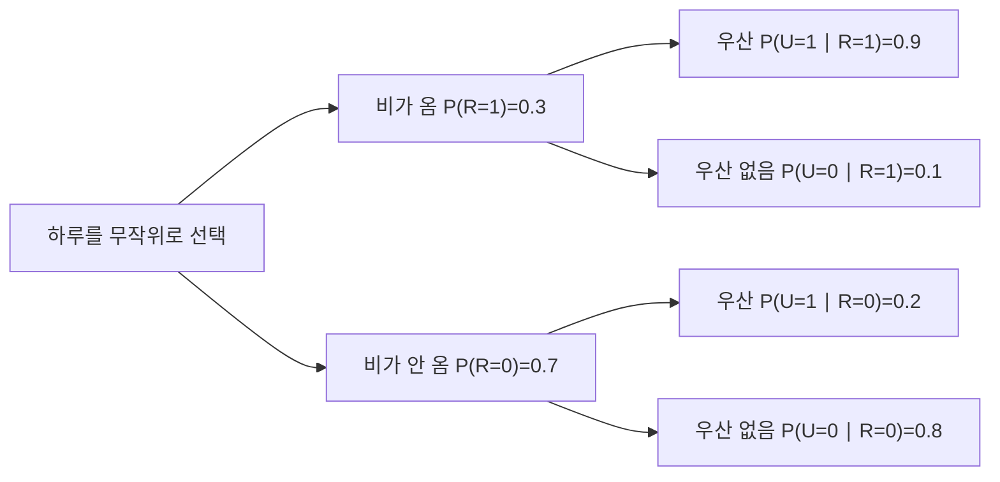

<p class="ai-assisted-disclosure">이 글은 AI의 도움을 받아 작성되었습니다.</p>

[← Chapter 1. 정보란 무엇인가](/notes/info/c01_introduction/) · [Information Theory 학습 커리큘럼](/notes/info/curriculum/)

# Chapter 2. 확률은 불확실성을 표현하는 언어다

> 비가 올 확률에서 다음 토큰의 확률까지

## 이 장에서 배울 것

Chapter 1에서는 사건의 확률 $p(x)$가 주어졌다고 가정하고 자기정보량(self-information)을 계산했다.

$$
I(x)=-\log_2p(x)
$$

그런데 실제 문제에서는 확률부터 정해야 한다. 비가 올 가능성, 우산을 든 사람을 볼 가능성, 문장 뒤에 특정 토큰이 나올 가능성을 어떤 구조로 표현해야 할까? 새로운 증거를 관측한 뒤에는 확률을 어떻게 바꿔야 할까?

확률(probability)은 모르는 정도를 숫자로 적는 언어다. 이 장에서는 하나의 우산 예제를 계속 확장하면서 그 문법을 익힌다. 이 장을 마치면 다음을 할 수 있다.

- 표본공간(sample space), 결과(outcome), 사건(event)을 구분한다.
- 확률변수(random variable)와 확률질량함수(probability mass function, PMF)를 설명한다.
- 결합확률(joint probability)에서 주변확률(marginal probability)과 조건부확률(conditional probability)을 계산한다.
- 독립(independence)과 조건부 독립(conditional independence)을 구분한다.
- 베이즈 정리(Bayes' theorem)로 관측 전 확률을 관측 후 확률로 갱신한다.
- 언어 모델의 $p(x_t\mid x_{<t})$를 조건부확률로 읽는다.

### 핵심 용어 표기

| 한글 용어 | 영어 원문 | 이 장에서의 뜻 |
|---|---|---|
| 표본공간 | sample space | 가능한 모든 결과의 집합 |
| 사건 | event | 관심 있는 결과들을 모은 집합 |
| 확률변수 | random variable | 각 결과를 숫자나 범주에 대응시키는 함수 |
| 확률분포 | probability distribution | 가능한 값과 각 값의 확률을 나타낸 규칙 |
| 확률질량함수 | probability mass function, PMF | 이산 확률변수가 특정 값을 가질 확률 |
| 결합확률 | joint probability | 여러 사건이나 변수의 값이 함께 나타날 확률 |
| 주변확률 | marginal probability | 다른 변수를 합산해 관심 변수만 남긴 확률 |
| 조건부확률 | conditional probability | 어떤 사건을 알게 된 뒤 다시 계산한 확률 |
| 독립 | independence | 한 사건을 알아도 다른 사건의 확률이 바뀌지 않는 관계 |
| 사전확률 | prior probability | 증거를 보기 전의 확률 |
| 가능도 | likelihood | 가설이 참일 때 현재 증거가 관측될 확률 |
| 사후확률 | posterior probability | 증거를 반영한 뒤의 확률 |

---

## 2.1 가능한 결과부터 적기

아침에 창밖을 보지 않은 채 집을 나선다고 하자. 오늘의 날씨를 아주 단순하게 두 가지로만 나눈다.

$$
\Omega=\{\text{비},\ \text{비 안 옴}\}
$$

$\Omega$는 **표본공간(sample space)**이다. 실험이나 관측에서 나올 수 있는 모든 결과를 모은 집합이다. 표본공간에 들어 있는 개별 항목은 **결과(outcome)**라고 부른다.

관심 있는 결과를 묶으면 **사건(event)**이 된다. 위 표본공간에서는 “비가 온다”가 결과 하나로 이루어진 사건이다. 주사위를 던지는 문제라면 표본공간과 사건이 다음처럼 달라진다.

$$
\Omega=\{1,2,3,4,5,6\}
$$

$$
A=\{2,4,6\}=\{\text{짝수가 나온다}\}
$$

사건 $A$는 숫자 하나가 아니라 결과 세 개를 묶은 집합이다. 이 구분은 조건부확률을 배울 때 중요하다. 확률은 결과 자체가 아니라 사건에 배정하기 때문이다.

### 확률이 지켜야 하는 규칙

확률은 세 가지 기본 규칙을 만족한다.

1. 모든 사건 $A$에 대해 $P(A)\ge 0$이다.
2. 표본공간 전체의 확률은 $P(\Omega)=1$이다.
3. 동시에 일어날 수 없는 사건들은 확률을 더할 수 있다.

예를 들어 공정한 주사위에서 1 또는 2가 나올 확률은 다음과 같다.

$$
P(\{1,2\})=P(\{1\})+P(\{2\})
=\frac16+\frac16=\frac13
$$

비가 올 확률을 $0.3$으로 정했다면 비가 오지 않을 확률은 자동으로 $0.7$이 된다.

$$
P(\text{비 안 옴})=1-P(\text{비})=1-0.3=0.7
$$

확률 $0.3$은 오늘 반드시 비가 30%만큼 온다는 뜻이 아니다. 같은 조건의 날을 많이 관측했을 때 약 30%에서 비가 온다고 보는 모형이다. 확률은 우리가 정한 확률모형(probability model) 안에서 해석해야 한다.

---

## 2.2 확률변수는 결과를 값으로 바꾸는 함수다

이름 때문에 자주 오해하지만 **확률변수(random variable)**는 단순히 “무작위로 변하는 숫자”가 아니다. 표본공간의 각 결과를 우리가 다루기 편한 값에 대응시키는 함수다.

오늘 비가 오는지를 나타내는 확률변수 $R$을 다음처럼 정의하자.

$$
R=
\begin{cases}
1 & \text{비가 옴}\\
0 & \text{비가 오지 않음}
\end{cases}
$$

이제 자연어 사건을 수식으로 간단하게 쓸 수 있다.

$$
P(R=1)=0.3,\qquad P(R=0)=0.7
$$

확률변수가 가질 수 있는 값과 각 값의 확률을 모으면 **확률분포(probability distribution)**가 된다. $R$처럼 가능한 값이 셀 수 있을 때는 **확률질량함수(probability mass function, PMF)**를 쓴다.

$$
p_R(r)=P(R=r)
$$

| $r$ | 뜻 | $p_R(r)$ |
|---:|---|---:|
| $0$ | 비가 오지 않음 | $0.7$ |
| $1$ | 비가 옴 | $0.3$ |

PMF의 모든 값을 더하면 1이어야 한다.

$$
\sum_r p_R(r)=0.7+0.3=1
$$

### 숫자가 아닌 범주도 다룰 수 있다

확률변수의 값은 계산하기 편하도록 숫자로 적는 경우가 많다. 하지만 개념의 핵심은 결과를 값에 대응시키는 데 있다. 다음 토큰을 나타내는 확률변수 $T$는 `찌개`, `볶음밥`, `우동` 같은 범주를 값으로 가질 수 있다.

$$
T\in\{\text{찌개},\text{볶음밥},\text{우동}\}
$$

정보이론에서는 어떤 확률변수를 정의했는지부터 확인해야 한다. 같은 현실을 보고도 “비의 유무”, “강수량”, “우산 판매량”처럼 서로 다른 변수를 만들 수 있고, 변수에 따라 분포와 정보량도 달라진다.

---

## 2.3 두 변수를 함께 보면 결합확률이 된다

이제 길을 걷는 사람이 우산을 들었는지도 기록하자. 우산을 들었으면 $U=1$, 들지 않았으면 $U=0$으로 둔다.

변수 $R$과 $U$가 어떤 값을 **함께** 가질 확률을 **결합확률(joint probability)**이라고 한다.

$$
p_{R,U}(r,u)=P(R=r,U=u)
$$

100일을 관측해 다음과 같은 횟수를 얻었다고 가정하자.

| | $U=1$ 우산을 듦 | $U=0$ 우산을 안 듦 | 합계 |
|---|---:|---:|---:|
| $R=1$ 비가 옴 | 27일 | 3일 | 30일 |
| $R=0$ 비가 안 옴 | 14일 | 56일 | 70일 |
| 합계 | 41일 | 59일 | 100일 |

각 횟수를 100으로 나누면 결합확률표(joint probability table)를 얻는다.

| | $U=1$ | $U=0$ | 합계 |
|---|---:|---:|---:|
| $R=1$ | $0.27$ | $0.03$ | $0.30$ |
| $R=0$ | $0.14$ | $0.56$ | $0.70$ |
| 합계 | $0.41$ | $0.59$ | $1.00$ |

표의 안쪽 네 칸을 모두 더하면 1이다.

$$
0.27+0.03+0.14+0.56=1
$$

예를 들어 $P(R=1,U=1)=0.27$은 임의로 고른 날에 비가 오고, 관측한 사람이 우산도 들었을 확률이다. 쉼표는 두 조건이 동시에 성립한다는 뜻으로 읽는다.

---

## 2.4 합해서 하나만 남기는 주변확률

결합확률표에서 날씨를 잠시 무시하고 우산을 든 확률만 알고 싶다고 하자. 비가 온 경우와 오지 않은 경우를 더하면 된다.

$$
P(U=1)
=P(R=1,U=1)+P(R=0,U=1)
=0.27+0.14
=0.41
$$

이렇게 다른 변수를 합산해 관심 있는 변수만 남긴 확률을 **주변확률(marginal probability)**이라고 한다. 이름은 표의 가장자리에 합계가 놓이는 데서 왔다.

일반식으로 쓰면 다음과 같다.

$$
p_U(u)=\sum_r p_{R,U}(r,u)
$$

반대로 비가 올 주변확률은 우산 변수의 값을 합해서 구한다.

$$
P(R=1)=P(R=1,U=1)+P(R=1,U=0)=0.27+0.03=0.30
$$

> 결합분포에서 어떤 변수를 없애고 싶다면 그 변수가 가질 수 있는 모든 값에 대해 합한다. 이 연산을 주변화(marginalization)라고 부른다.

연속 확률변수(continuous random variable)에서는 합 대신 적분을 사용한다. 이 책의 앞부분에서는 계산을 눈으로 확인하기 쉬운 이산 확률변수(discrete random variable)를 중심으로 다룬다.

---

## 2.5 정보를 알게 된 뒤의 조건부확률

아무 정보가 없을 때 우산을 든 사람을 볼 확률은 $0.41$이었다. 이제 **비가 온다는 사실을 이미 안다**고 하자. 가능한 100일 전체가 아니라 비가 온 30일만 새 표본공간처럼 놓고 계산한다.

비가 온 30일 가운데 우산을 든 날은 27일이다.

$$
P(U=1\mid R=1)=\frac{27}{30}=0.9
$$

기호 $\mid$는 “~가 주어졌을 때”라고 읽는다. $P(U=1\mid R=1)$은 비가 왔다는 조건 아래에서 우산을 들 확률이다.

**조건부확률(conditional probability)**의 정의는 다음과 같다.

$$
P(A\mid B)=\frac{P(A\cap B)}{P(B)},\qquad P(B)>0
$$

우산 예제에 적용하면 같은 값이 나온다.

$$
P(U=1\mid R=1)
=\frac{P(U=1,R=1)}{P(R=1)}
=\frac{0.27}{0.30}
=0.9
$$

조건부확률은 단순히 두 사건이 함께 일어날 확률이 아니다.

$$
P(U=1,R=1)=0.27
$$

$$
P(U=1\mid R=1)=0.9
$$

첫 번째 값은 전체 날 가운데 비와 우산이 함께 나타난 비율이다. 두 번째 값은 비가 온 날만 남긴 뒤 그 안에서 우산을 든 비율이다. 분모가 다르므로 값도 다르다.

### 조건의 방향을 바꾸면 값도 바뀐다

이번에는 우산을 든 사람을 보았을 때 비가 올 확률을 구해 보자.

$$
P(R=1\mid U=1)
=\frac{P(R=1,U=1)}{P(U=1)}
=\frac{0.27}{0.41}
\approx 0.659
$$

따라서 다음 두 값은 일반적으로 같지 않다.

$$
P(U=1\mid R=1)\ne P(R=1\mid U=1)
$$

비가 오면 우산을 들 확률은 $90\%$지만, 우산을 든 사람을 보았을 때 실제로 비가 올 확률은 약 $65.9\%$다. 맑은 날에도 햇빛을 피하려고 우산을 들 수 있기 때문이다.

---

## 2.6 곱셈 법칙과 확률나무

조건부확률의 정의를 정리하면 결합확률을 두 항의 곱으로 쓸 수 있다.

$$
P(A,B)=P(A)P(B\mid A)
$$

우산 예제에서는 다음과 같다.

$$
P(R=1,U=1)
=P(R=1)P(U=1\mid R=1)
=0.3\times0.9
=0.27
$$

이 관계를 **확률의 곱셈 법칙(product rule)**이라고 한다. 확률나무(probability tree)에서는 한 경로에 있는 확률을 곱하면 그 경로의 결합확률이 된다.



*그림 1. 날씨와 우산의 조건부확률을 나타낸 확률나무. 한 경로의 확률을 곱하면 결합확률이 된다.*

비가 오지 않았는데 우산을 들 확률도 같은 방법으로 계산한다.

$$
P(R=0,U=1)=0.7\times0.2=0.14
$$

서로 다른 경로가 같은 결과로 이어진다면 경로별 확률을 더한다. 우산을 든 경우는 두 경로에서 나온다.

$$
P(U=1)=0.3\times0.9+0.7\times0.2=0.41
$$

이 계산은 앞 절에서 결합확률표의 세로 열을 더한 것과 같다.

---

## 2.7 독립은 조건을 알아도 확률이 바뀌지 않는다는 뜻이다

두 사건 $A$와 $B$가 **독립(independent)**이라면 $B$를 알게 되어도 $A$의 확률이 바뀌지 않는다.

$$
P(A\mid B)=P(A)
$$

곱셈 법칙에 이 식을 넣으면 독립의 또 다른 정의를 얻는다.

$$
P(A,B)=P(A)P(B)
$$

우산과 비는 독립일까? 주변확률과 조건부확률을 비교해 보자.

$$
P(U=1)=0.41
$$

$$
P(U=1\mid R=1)=0.9
$$

비가 온다는 사실을 알자 우산을 들 확률이 크게 바뀌었다. 따라서 두 변수는 독립이 아니다. 곱으로 확인해도 같은 결론을 얻는다.

$$
P(R=1,U=1)=0.27
$$

$$
P(R=1)P(U=1)=0.3\times0.41=0.123
$$

두 값이 다르므로 독립 조건을 만족하지 않는다.

### 서로 배타적인 사건과 독립은 다르다

**상호배타(mutually exclusive)**인 두 사건은 동시에 일어날 수 없다. 공정한 주사위 한 번에서 “1이 나옴”과 “2가 나옴”은 상호배타적이다.

$$
P(A,B)=0
$$

그러나 각 사건의 확률이 0이 아니라면 다음 곱은 양수다.

$$
P(A)P(B)=\frac16\times\frac16=\frac1{36}
$$

그러므로 두 사건은 독립이 아니다. $A$가 일어났다는 사실을 알면 $B$가 일어날 가능성이 0이 되기 때문이다. “함께 일어나지 않는다”와 “서로 영향을 주지 않는다”를 혼동하면 안 된다.

### 조건부 독립

두 변수가 그대로는 연관되어 있어도 세 번째 변수를 알고 나면 독립이 될 수 있다. 이를 **조건부 독립(conditional independence)**이라고 한다.

$$
P(A,B\mid C)=P(A\mid C)P(B\mid C)
$$

예를 들어 여러 사람이 우산을 들었는지는 날씨라는 공통 원인 때문에 서로 관련되어 보일 수 있다. 날씨를 이미 알고 있고 각 사람이 독립적으로 우산을 결정한다고 가정하면, 사람들의 선택은 날씨를 조건으로 독립이라고 모델링할 수 있다.

조건부 독립은 “아무 관계도 없다”는 말이 아니다. 어떤 조건 $C$를 고정했을 때 남은 관계가 사라진다는 뜻이다.

---

## 2.8 베이즈 정리는 조건의 방향을 뒤집는다

곱셈 법칙은 같은 결합확률을 두 방향으로 쓸 수 있다고 말한다.

$$
P(A,B)=P(A)P(B\mid A)
$$

$$
P(A,B)=P(B)P(A\mid B)
$$

두 식의 오른쪽을 같게 놓고 $P(A\mid B)$에 대해 정리하면 **베이즈 정리(Bayes' theorem)**를 얻는다.

$$
P(A\mid B)=\frac{P(B\mid A)P(A)}{P(B)}
$$

각 항에는 이름이 있다.

| 항 | 이름 | 질문 |
|---|---|---|
| $P(A)$ | 사전확률(prior probability) | 증거를 보기 전에 $A$를 얼마나 믿는가? |
| $P(B\mid A)$ | 가능도(likelihood) | $A$가 참이면 증거 $B$가 얼마나 잘 나타나는가? |
| $P(B)$ | 증거(evidence) | 증거 $B$ 자체는 얼마나 자주 나타나는가? |
| $P(A\mid B)$ | 사후확률(posterior probability) | 증거를 본 뒤 $A$를 얼마나 믿는가? |

우산 예제에서 $A$를 비, $B$를 우산이라고 두면 다음과 같다.

$$
P(R=1\mid U=1)
=\frac{P(U=1\mid R=1)P(R=1)}{P(U=1)}
=\frac{0.9\times0.3}{0.41}
\approx0.659
$$

베이즈 정리는 새로운 정보를 만들어 내지 않는다. 이미 알고 있는 $P(B\mid A)$와 사전확률을 이용해 우리가 궁금한 반대 방향의 조건부확률 $P(A\mid B)$을 계산한다.

---

## 2.9 의료 검사에서 기저율을 놓치면 생기는 오류

어떤 질병과 검사에 대해 다음 조건을 가정하자.

- 질병에 걸린 사람의 비율은 $1\%$다.
- 환자가 양성 판정을 받을 확률은 $99\%$다.
- 건강한 사람이 음성 판정을 받을 확률은 $95\%$다.

두 번째 값은 **민감도(sensitivity)**, 세 번째 값은 **특이도(specificity)**다. 건강한 사람이 양성 판정을 받을 위양성률(false positive rate)은 $5\%$다.

양성 판정을 받은 사람이 실제 환자일 확률은 $99\%$일까? 10,000명을 검사한다고 생각하면 계산이 선명해진다.

| 구분 | 사람 수 | 양성 판정 |
|---|---:|---:|
| 환자 | $100$ | $99$ |
| 건강한 사람 | $9{,}900$ | $495$ |
| 합계 | $10{,}000$ | $594$ |

양성 판정 594건 가운데 실제 환자는 99명이다.

$$
P(\text{질병}\mid\text{양성})
=\frac{99}{594}
=\frac16
\approx0.167
$$

베이즈 정리로 직접 계산해도 같다.

$$
P(\text{질병}\mid\text{양성})
=\frac{0.99\times0.01}
{0.99\times0.01+0.05\times0.99}
\approx0.167
$$

검사가 부정확해서 이런 결과가 나온 것은 아니다. 질병 자체가 드물어서 건강한 사람의 위양성이 환자의 양성보다 많이 생겼다. 이때 질병의 원래 비율 $1\%$를 **기저율(base rate)**이라고 한다. 기저율을 무시하고 민감도만 보는 실수를 **기저율 오류(base-rate fallacy)**라고 부른다.

> 이 예제는 확률 계산을 설명하기 위한 가상 수치다. 실제 검사 결과는 해당 검사의 성능, 대상 집단, 반복 검사 여부를 반영해 의료 전문가와 해석해야 한다.

---

## 2.10 연쇄 법칙으로 여러 변수를 분해하기

두 변수의 곱셈 법칙을 여러 변수로 확장하면 **확률의 연쇄 법칙(chain rule of probability)**을 얻는다.

$$
p(x_1,x_2,x_3)
=p(x_1)p(x_2\mid x_1)p(x_3\mid x_1,x_2)
$$

변수가 $T$개라면 다음과 같다.

$$
p(x_1,\ldots,x_T)
=\prod_{t=1}^{T}p(x_t\mid x_{<t})
$$

여기서 $x_{<t}$는 $x_1,\ldots,x_{t-1}$을 짧게 쓴 기호다. 이 식은 어떤 결합분포에도 성립한다. 각 확률을 실제로 어떻게 추정할지는 별도의 모델링 문제다.

세 단어로 이루어진 짧은 문장을 생각해 보자.

> 오늘 비 온다

모델이 다음 확률을 준다고 가정한다.

$$
p(\text{오늘})=0.1
$$

$$
p(\text{비}\mid\text{오늘})=0.2
$$

$$
p(\text{온다}\mid\text{오늘, 비})=0.5
$$

문장 전체의 확률은 세 값을 곱한 $0.01$이다.

$$
p(\text{오늘, 비, 온다})=0.1\times0.2\times0.5=0.01
$$

Chapter 1에서 본 시퀀스 손실(sequence loss)이 토큰별 손실의 합이 되는 이유도 여기에 있다. 확률의 곱에 음의 로그를 취하면 합으로 바뀐다.

$$
-\log p(x_1,\ldots,x_T)
=\sum_{t=1}^{T}-\log p(x_t\mid x_{<t})
$$

---

## 2.11 언어 모델의 다음 토큰 확률 읽기

**자기회귀 언어 모델(autoregressive language model)**은 지금까지의 토큰 $x_{<t}$를 조건으로 다음 토큰 $x_t$의 분포를 예측한다.

$$
p_\theta(x_t\mid x_{<t})
$$

$\theta$는 모델의 매개변수(parameter)를 뜻한다. 이 식을 자연어로 읽으면 다음과 같다.

> 매개변수 $\theta$를 가진 모델이 앞선 토큰 $x_{<t}$를 보았을 때, 다음 토큰이 $x_t$일 확률

문맥이 바뀌면 조건부확률도 바뀐다.

| 문맥 | 다음 토큰 후보 | 예시 확률 |
|---|---|---:|
| `오늘 하늘에서 비가` | `온다` | $0.70$ |
| `회의가 끝난 뒤 집에` | `온다` | $0.35$ |
| `정답을 알고 있는 사람만 손을` | `든다` | $0.60$ |

같은 `온다`라는 토큰도 앞 문맥에 따라 확률이 달라진다. 언어 모델이 사용하는 것은 토큰 자체의 고정 확률이 아니라 문맥에 따른 조건부 분포다.

### 조건부확률은 인과관계가 아니다

$P(B\mid A)$가 높다고 해서 $A$가 반드시 $B$의 원인인 것은 아니다. 텍스트에서 `비` 다음에 `온다`가 자주 등장한다는 사실은 두 토큰의 통계적 관계를 말한다. 그것만으로 실제 날씨의 인과 구조를 증명할 수는 없다.

언어 모델의 조건부확률도 학습 데이터와 모델이 포착한 패턴을 나타낸다. 높은 확률을 곧 사실성, 인과성, 인간과 같은 이해로 해석하면 안 된다.

### $p$와 $q$를 구분하기

정보이론에서는 실제 데이터 분포를 $p$, 모델이 추정한 분포를 $q$로 구분해 쓰기도 한다.

$$
x_t\sim p(\cdot\mid x_{<t}),\qquad
q_\theta(x_t\mid x_{<t})\approx p(x_t\mid x_{<t})
$$

현실의 $p$를 정확히 알 수 없으므로 데이터 표본을 이용해 $q_\theta$를 학습한다. 이후 교차 엔트로피(cross-entropy)와 KL 발산(KL divergence)을 배울 때 두 분포를 구분하는 표기가 중요해진다.

---

## 2.12 코드로 결합분포 확인하기

다음 코드는 우산 예제의 결합분포에서 주변확률과 조건부확률을 계산한다.

```python
joint = {
    (1, 1): 0.27,
    (1, 0): 0.03,
    (0, 1): 0.14,
    (0, 0): 0.56,
}


def marginal_r(r: int) -> float:
    return sum(prob for (rain, _), prob in joint.items() if rain == r)


def marginal_u(u: int) -> float:
    return sum(prob for (_, umbrella), prob in joint.items() if umbrella == u)


def conditional_u_given_r(u: int, r: int) -> float:
    return joint[(r, u)] / marginal_r(r)


assert abs(sum(joint.values()) - 1.0) < 1e-12

print(f"P(R=1) = {marginal_r(1):.2f}")
print(f"P(U=1) = {marginal_u(1):.2f}")
print(f"P(U=1 | R=1) = {conditional_u_given_r(1, 1):.2f}")
```

예상 출력은 다음과 같다.

```text
P(R=1) = 0.30
P(U=1) = 0.41
P(U=1 | R=1) = 0.90
```

### 실험할 것

1. $P(R=1\mid U=1)$을 계산하는 함수를 추가한다.
2. 결합분포의 한 값을 바꾼 뒤 합이 1이 되도록 나머지 값도 조정한다.
3. 독립인 두 베르누이 변수(Bernoulli variables)의 결합분포를 만들고 $P(R,U)=P(R)P(U)$를 확인한다.
4. 의료 검사 예제의 기저율을 $0.01$, $0.1$, $0.5$로 바꾸며 양성 판정 뒤의 사후확률을 비교한다.

---

## 2.13 자주 하는 오해

### 오해 1. 확률변수는 반드시 값이 계속 변하는 숫자다

확률변수는 표본공간의 결과를 값에 대응시키는 함수다. 이산적인 숫자뿐 아니라 토큰처럼 범주형 값을 다루는 데도 같은 개념을 쓴다.

### 오해 2. $P(A\mid B)$와 $P(B\mid A)$는 같다

두 확률은 조건으로 삼는 사건이 다르다. 우산 예제에서 $P(U=1\mid R=1)=0.9$였지만 $P(R=1\mid U=1)\approx0.659$였다.

### 오해 3. 상관된 두 사건은 서로 원인과 결과다

확률적 의존성(probabilistic dependence)만으로 인과관계(causality)를 확정할 수 없다. 공통 원인, 표본 선택, 우연한 관계도 두 사건을 연관되어 보이게 만든다.

### 오해 4. 상호배타이면 독립이다

확률이 0이 아닌 두 사건이 상호배타라면 오히려 한 사건의 발생이 다른 사건을 배제한다. 독립과 상호배타는 서로 다른 개념이다.

### 오해 5. 베이즈 정리는 사전확률 없이도 답을 준다

사후확률은 가능도와 사전확률을 함께 사용한다. 같은 검사 결과라도 대상 집단의 기저율이 다르면 사후확률도 달라진다.

### 오해 6. 언어 모델의 높은 확률은 문장이 참이라는 뜻이다

다음 토큰 확률은 주어진 문맥 뒤에 토큰이 나타날 가능성을 모델이 추정한 값이다. 문장의 사실 여부를 직접 검증하는 값은 아니다.

---

## 2.14 연습문제

### 기본 문제

1. 공정한 주사위의 표본공간을 쓰고 “3보다 큰 눈이 나온다”라는 사건을 집합으로 나타내라.
2. 동전을 두 번 던질 때 앞면의 개수를 나타내는 확률변수 $X$의 가능한 값을 쓰고 PMF를 구하라.
3. 우산 예제에서 $P(R=0)$과 $P(U=0)$을 구하라.
4. $P(R=0,U=0)$과 $P(U=0\mid R=0)$을 각각 구하고 차이를 설명하라.
5. 우산 예제에서 $P(R=1\mid U=0)$을 구하라.

### 이해 문제

6. 주변확률을 구할 때 결합확률표의 행이나 열을 더하는 이유를 설명하라.
7. $P(A)=0.4$, $P(B)=0.5$, $P(A,B)=0.2$일 때 두 사건이 독립인지 확인하라.
8. 확률이 0이 아닌 상호배타 사건 두 개가 독립일 수 없는 이유를 식으로 설명하라.
9. 조건부 독립과 무조건적인 독립의 차이를 예시와 함께 설명하라.
10. 의료 검사 예제에서 민감도가 높아도 양성 판정 뒤의 질병 확률이 낮을 수 있는 이유를 설명하라.

### LLM 연결 문제

11. $p(\text{비}\mid\text{오늘})=0.2$는 무엇을 조건으로 한 어떤 확률인지 문장으로 읽어라.
12. $p(x_1)=0.1$, $p(x_2\mid x_1)=0.4$, $p(x_3\mid x_1,x_2)=0.5$일 때 시퀀스 $(x_1,x_2,x_3)$의 확률을 구하라.
13. 12번 시퀀스의 자기정보량을 비트 단위로 구하라.
14. 같은 토큰의 확률이 문맥마다 달라지는 예를 하나 만들어라.
15. 다음 토큰 확률이 높은 문장이 반드시 사실은 아닌 이유를 설명하라.

### 탐구 문제

16. 의료 검사 예제에서 기저율만 $10\%$로 바꾸고 양성 판정 뒤의 질병 확률을 다시 구하라.
17. 우산 예제의 결합분포를 이용해 $R$과 $U$의 모든 조건부확률을 표로 정리하라.
18. 세 토큰의 작은 어휘를 정하고 문맥 두 개에 서로 다른 다음 토큰 분포를 만든 뒤 각 분포의 합이 1인지 확인하라.

---

## 2.15 연습문제 짧은 정답

1. $\Omega=\{1,2,3,4,5,6\}$, 사건은 $\{4,5,6\}$이다.
2. $X\in\{0,1,2\}$이며 $P(X=0)=1/4$, $P(X=1)=1/2$, $P(X=2)=1/4$이다.
3. $P(R=0)=0.7$, $P(U=0)=0.59$다.
4. $P(R=0,U=0)=0.56$은 전체 날에서 두 조건이 함께 성립할 확률이다. $P(U=0\mid R=0)=0.56/0.70=0.8$은 비가 오지 않은 날만 놓고 계산한 확률이다.
5. $P(R=1\mid U=0)=0.03/0.59\approx0.051$이다.
7. $P(A)P(B)=0.4\times0.5=0.2=P(A,B)$이므로 독립이다.
8. 상호배타이면 $P(A,B)=0$이지만 $P(A)>0$, $P(B)>0$이면 $P(A)P(B)>0$이다. 따라서 독립 조건을 만족하지 않는다.
12. $0.1\times0.4\times0.5=0.02$다.
13. $-\log_2 0.02\approx5.644$비트다.
16. 다음과 같다.

$$
P(\text{질병}\mid\text{양성})
=\frac{0.99\times0.10}
{0.99\times0.10+0.05\times0.90}
=0.6875
$$

---

## 2.16 이 장의 요약

1. 표본공간(sample space)은 가능한 모든 결과의 집합이고, 사건(event)은 그중 관심 있는 결과를 모은 집합이다.
2. 확률변수(random variable)는 결과를 숫자나 범주에 대응시키는 함수다.
3. 결합확률(joint probability)은 여러 변수의 값이 함께 나타날 확률이다.
4. 주변확률(marginal probability)은 결합분포에서 다른 변수를 합산해 없앤 값이다.
5. 조건부확률(conditional probability)은 조건에 맞는 경우만 남겨 표본공간을 다시 정한 확률이다.

$$
P(A\mid B)=\frac{P(A,B)}{P(B)}
$$

6. 독립(independence)이면 조건을 알아도 확률이 바뀌지 않는다.

$$
P(A,B)=P(A)P(B)
$$

7. 베이즈 정리(Bayes' theorem)는 조건부확률의 방향을 바꾼다.

$$
P(A\mid B)=\frac{P(B\mid A)P(A)}{P(B)}
$$

8. 확률의 연쇄 법칙(chain rule of probability)은 시퀀스의 결합확률을 조건부확률의 곱으로 분해한다.

$$
p(x_1,\ldots,x_T)=\prod_{t=1}^{T}p(x_t\mid x_{<t})
$$

9. 자기회귀 언어 모델(autoregressive language model)은 앞 토큰을 조건으로 다음 토큰의 확률분포를 예측한다.
10. 조건부확률이 높다는 사실만으로 인과관계나 문장의 사실성을 결론 내릴 수 없다.

---

## 2.17 다음 장으로 가기 전에

책을 덮고 아래 질문에 답해 보자.

- 결과, 사건, 확률변수는 어떻게 다른가?
- 결합확률표에서 주변확률을 어떻게 구하는가?
- $P(A,B)$와 $P(A\mid B)$는 무엇이 다른가?
- 왜 $P(A\mid B)$와 $P(B\mid A)$가 일반적으로 다른가?
- 독립과 상호배타는 어떻게 다른가?
- 베이즈 정리에서 사전확률과 사후확률은 무엇인가?
- 기저율이 사후확률에 왜 영향을 주는가?
- 언어 모델의 $p(x_t\mid x_{<t})$를 문장으로 어떻게 읽는가?
- 시퀀스 확률이 토큰별 조건부확률의 곱이 되는 이유는 무엇인가?

일곱 개 이상을 자신의 말로 설명할 수 있다면 Chapter 3으로 넘어가도 좋다. 다음 장에서는 사건 하나의 확률이 아니라 분포 전체의 평균 불확실성을 재는 엔트로피(entropy)를 배운다.
