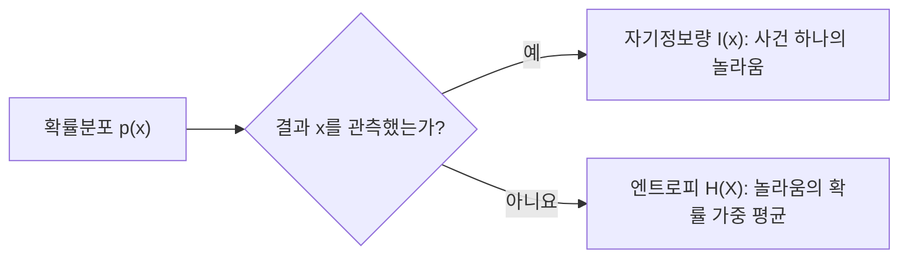

<p class="ai-assisted-disclosure">이 글은 AI의 도움을 받아 작성되었습니다.</p>

[← Chapter 2. 확률은 불확실성을 표현하는 언어다](/notes/info/c02_probability/) · [Information Theory 학습 커리큘럼](/notes/info/curriculum/)

# Chapter 3. 엔트로피: 평균적으로 얼마나 놀라운가

> 사건 하나의 놀라움에서 분포 전체의 불확실성으로

## 이 장에서 배울 것

Chapter 1에서는 실제로 일어난 사건 하나의 자기정보량(self-information)을 정의했다.

$$
I(x)=-\log_2p(x)
$$

Chapter 2에서는 가능한 결과와 그 확률을 확률분포(probability distribution)로 표현했다. 이제 두 생각을 합칠 차례다. 아직 결과를 관측하지 않았다면 어떤 $x$가 나올지 모른다. 이때 분포 전체가 평균적으로 얼마나 놀라운지를 어떻게 잴 수 있을까?

그 답이 **엔트로피(entropy)**다. 이 장을 마치면 다음을 할 수 있다.

- 자기정보량과 엔트로피를 구분한다.
- 이산 확률변수(discrete random variable)의 샤논 엔트로피(Shannon entropy)를 계산한다.
- 공정한 동전과 치우친 동전의 불확실성을 수치로 비교한다.
- 베르누이 엔트로피(Bernoulli entropy)가 $p=1/2$에서 최대인 이유를 설명한다.
- 결과가 $N$개인 분포의 엔트로피가 균등분포(uniform distribution)에서 최대가 되는 이유를 설명한다.
- 엔트로피를 평균 질문 수와 평균 부호 길이(average code length)로 해석한다.
- 언어 모델의 다음 토큰 엔트로피(next-token entropy)를 읽고, 토큰 손실(token loss)과 구분한다.

### 핵심 용어 표기

| 한글 용어 | 영어 원문 | 이 장에서의 뜻 |
|---|---|---|
| 자기정보량 | self-information | 실제로 관측한 사건 하나의 놀라움 |
| 놀라움 | surprisal | 자기정보량을 강조해 부르는 이름 |
| 기댓값 | expectation | 가능한 값들을 각 확률로 가중한 평균 |
| 엔트로피 | entropy | 관측 전 분포가 가진 평균 불확실성 |
| 샤논 엔트로피 | Shannon entropy | 자기정보량의 기댓값으로 정의한 엔트로피 |
| 베르누이 엔트로피 | Bernoulli entropy | 결과가 두 개인 베르누이 분포의 엔트로피 |
| 균등분포 | uniform distribution | 가능한 모든 결과의 확률이 같은 분포 |
| 최대 엔트로피 | maximum entropy | 주어진 조건에서 가능한 가장 큰 엔트로피 |
| 경험적 엔트로피 | empirical entropy | 표본에서 센 빈도로 계산한 엔트로피 |
| 다음 토큰 엔트로피 | next-token entropy | 주어진 문맥에서 모델의 다음 토큰 분포가 가진 엔트로피 |

---

## 3.1 결과를 보기 전에는 무엇을 계산해야 할까

두 개의 상자가 있다고 하자.

- 상자 A에는 빨간 공과 파란 공이 각각 50개 들어 있다.
- 상자 B에는 빨간 공이 99개, 파란 공이 1개 들어 있다.

눈을 감고 공 하나를 꺼내기 전에는 어느 색이 나올지 모른다. 하지만 두 상자의 불확실성은 같아 보이지 않는다. 상자 A에서는 어느 색이 나올지 팽팽하다. 상자 B에서는 거의 틀림없이 빨간 공이 나온다.

실제로 파란 공을 꺼냈을 때의 놀라움은 오히려 상자 B에서 훨씬 크다.

$$
I_A(\text{파랑})=-\log_2 0.5=1\text{ bit}
$$

$$
I_B(\text{파랑})=-\log_2 0.01\approx6.644\text{ bits}
$$

그렇다고 상자 B가 뽑기 전부터 더 불확실한 것은 아니다. 대부분 빨간 공이 나오기 때문이다. 여기서 서로 다른 질문이 드러난다.

| 시점 | 질문 | 필요한 양 |
|---|---|---|
| 결과를 관측한 뒤 | 실제로 나온 결과가 얼마나 놀라운가? | 자기정보량 $I(x)$ |
| 결과를 관측하기 전 | 이 분포에서는 평균적으로 얼마나 놀랄 것인가? | 엔트로피 $H(X)$ |



*그림 1. 자기정보량은 관측된 사건 하나를, 엔트로피는 관측 전 분포 전체를 설명한다.*

엔트로피를 구하려면 가능한 모든 결과의 자기정보량을 평균해야 한다. 단순 평균이 아니라 자주 나오는 결과에 더 큰 가중치를 주는 확률 가중 평균이 필요하다.

---

## 3.2 기댓값은 확률로 가중한 평균이다

확률변수 $X$가 값 $x$를 가질 확률을 $p(x)$라고 하자. 함수 $g(X)$의 **기댓값(expectation)**은 다음과 같다.

$$
\mathbb{E}[g(X)]=\sum_x p(x)g(x)
$$

공정한 6면체 주사위의 눈을 그대로 확률변수 $X$로 두면 평균 눈은 다음과 같다.

$$
\mathbb{E}[X]
=\frac16\times1+\frac16\times2+\cdots+\frac16\times6
=3.5
$$

한 번 던진 주사위에서 3.5가 나오는 것은 아니다. 기댓값은 같은 실험을 많이 반복했을 때 관측값의 평균이 가까워지는 기준이다.

확률이 서로 다르면 각 값에 같은 비중을 줄 수 없다. 다음과 같은 상품 추첨을 생각해 보자.

| 상금 $x$ | 확률 $p(x)$ | 확률 × 상금 |
|---:|---:|---:|
| $0$원 | $0.8$ | $0$원 |
| $1{,}000$원 | $0.15$ | $150$원 |
| $10{,}000$원 | $0.05$ | $500$원 |

기대 상금은 다음과 같다.

$$
\mathbb{E}[X]
=0.8\times0+0.15\times1{,}000+0.05\times10{,}000
=650\text{원}
$$

엔트로피도 같은 방식으로 계산한다. 다만 평균을 내는 대상이 상금이나 주사위 눈이 아니라 각 결과의 자기정보량이다.

---

## 3.3 자기정보량을 평균하면 엔트로피가 된다

이산 확률변수 $X$의 자기정보량은 다음과 같다.

$$
I(x)=-\log_2p(x)
$$

이 값을 확률로 가중해 평균하면 **샤논 엔트로피(Shannon entropy)**를 얻는다.

$$
H(X)=\mathbb{E}[I(X)]
$$

식을 펼치면 다음과 같다.

$$
H(X)
=\sum_x p(x)I(x)
=-\sum_x p(x)\log_2p(x)
$$

가능한 값이 $x_1,x_2,\ldots,x_N$이라면 합 기호를 직접 펼쳐 쓸 수 있다.

$$
H(X)
=-p(x_1)\log_2p(x_1)
-p(x_2)\log_2p(x_2)
-\cdots
-p(x_N)\log_2p(x_N)
$$

로그의 밑이 2이므로 단위는 비트(bit)다. 자연로그를 사용하면 단위는 내트(nat)가 된다.

### 확률이 0인 항은 어떻게 계산할까

$p(x)=0$이면 $\log 0$은 정의되지 않는다. 하지만 엔트로피의 각 항은 $-p(x)\log p(x)$이고, 다음 극한은 0이다.

$$
\lim_{p\to0^+}-p\log p=0
$$

그래서 엔트로피를 계산할 때는 다음 관례를 사용한다.

$$
0\log 0=0
$$

일어날 수 없는 결과는 평균 놀라움에 기여하지 않는다는 뜻이다. 이는 “확률 0인 사건을 실제로 관측했을 때 자기정보량이 무한대”라는 Chapter 1의 설명과 모순되지 않는다. 엔트로피에서는 그 사건이 모형 안에서 관측될 확률도 0이므로 평균에 들어가는 가중치가 0이다.

---

## 3.4 공정한 동전과 치우친 동전

### 공정한 동전

공정한 동전은 앞면과 뒷면의 확률이 각각 $1/2$이다.

$$
H(X)
=-\frac12\log_2\frac12
-\frac12\log_2\frac12
$$

각 결과의 자기정보량이 1비트이므로 엔트로피도 1비트다.

$$
H(X)=\frac12\times1+\frac12\times1=1\text{ bit}
$$

### 앞면이 자주 나오는 동전

이번에는 앞면의 확률이 $0.9$, 뒷면의 확률이 $0.1$인 동전을 생각하자.

$$
I(\text{앞면})=-\log_2 0.9\approx0.152\text{ bits}
$$

$$
I(\text{뒷면})=-\log_2 0.1\approx3.322\text{ bits}
$$

뒷면이 나오면 크게 놀라지만 그런 경우는 드물다. 두 자기정보량을 발생 확률로 가중하면 다음과 같다.

$$
\begin{aligned}
H(X)
&=0.9\times0.152+0.1\times3.322\\
&\approx0.469\text{ bits}
\end{aligned}
$$

| 동전 | 앞면 확률 | 뒷면 확률 | 엔트로피 |
|---|---:|---:|---:|
| 공정한 동전 | $0.5$ | $0.5$ | $1$ bit |
| 치우친 동전 | $0.9$ | $0.1$ | 약 $0.469$ bits |
| 앞면만 나오는 동전 | $1$ | $0$ | $0$ bits |

엔트로피는 가장 놀라운 결과만 보지 않는다. 자주 나타나는 작은 놀라움과 드물게 나타나는 큰 놀라움을 모두 평균한다. 그래서 드문 뒷면의 자기정보량이 3비트를 넘더라도 분포 전체의 엔트로피는 1비트보다 작다.

---

## 3.5 베르누이 엔트로피

두 결과 가운데 하나가 나오는 확률변수를 **베르누이 확률변수(Bernoulli random variable)**라고 한다. $X\sim\mathrm{Bernoulli}(p)$라면 다음과 같다.

$$
P(X=1)=p,\qquad P(X=0)=1-p
$$

이 분포의 **베르누이 엔트로피(Bernoulli entropy)** 또는 **이진 엔트로피(binary entropy)**는 다음과 같다.

$$
h_2(p)
=-p\log_2p-(1-p)\log_2(1-p)
$$

대표적인 값을 계산해 보자.

| $p$ | $h_2(p)$ | 해석 |
|---:|---:|---|
| $0$ | $0$ bits | 항상 0이 나온다 |
| $0.1$ | 약 $0.469$ bits | 한쪽으로 크게 치우쳤다 |
| $0.25$ | 약 $0.811$ bits | 0이 더 자주 나온다 |
| $0.5$ | $1$ bit | 두 결과가 똑같이 가능하다 |
| $0.75$ | 약 $0.811$ bits | 1이 더 자주 나온다 |
| $0.9$ | 약 $0.469$ bits | 한쪽으로 크게 치우쳤다 |
| $1$ | $0$ bits | 항상 1이 나온다 |

이 함수에는 세 가지 특징이 있다.

1. $h_2(p)=h_2(1-p)$이므로 $p=1/2$을 기준으로 좌우가 대칭이다.
2. $p=0$ 또는 $p=1$이면 결과가 확실하므로 엔트로피가 0이다.
3. $p=1/2$이면 어느 결과도 예측하기 어렵고 엔트로피가 최대인 1비트다.

### 왜 $p=1/2$에서 최대일까

미분을 사용하면 최대 위치를 확인할 수 있다. 계산을 간단히 하려고 자연로그로 쓴 엔트로피를 생각하자.

$$
h(p)=-p\ln p-(1-p)\ln(1-p)
$$

일차 미분은 다음과 같다.

$$
h'(p)=\ln\frac{1-p}{p}
$$

$h'(p)=0$이 되는 지점은 $p=1/2$이다. 이차 미분은 $0<p<1$에서 항상 음수다.

$$
h''(p)=-\frac1p-\frac1{1-p}<0
$$

따라서 그래프는 아래로 굽어 있고, $p=1/2$에서 유일한 최댓값을 갖는다. 로그의 밑을 자연로그에서 2로 바꾸어도 양의 상수배만 달라지므로 최대 위치는 같다.

---

## 3.6 결과가 여러 개라면 균등분포가 가장 불확실하다

가능한 결과가 $N$개이고 모두 같은 확률을 갖는다고 하자.

$$
p(x)=\frac1N
$$

각 결과의 자기정보량은 같다.

$$
I(x)=-\log_2\frac1N=\log_2N
$$

같은 값을 평균해도 그대로이므로 균등분포의 엔트로피는 다음과 같다.

$$
H(X)=\log_2N
$$

| 결과 수 $N$ | 각 결과의 확률 | 엔트로피 |
|---:|---:|---:|
| $1$ | $1$ | $0$ bits |
| $2$ | $1/2$ | $1$ bit |
| $4$ | $1/4$ | $2$ bits |
| $8$ | $1/8$ | $3$ bits |
| $256$ | $1/256$ | $8$ bits |

결과 수가 두 배가 될 때마다 엔트로피는 1비트씩 늘어난다. 이는 Chapter 1의 스무고개에서 후보가 두 배가 될 때 이진 질문이 하나 더 필요했던 것과 같은 구조다.

### 엔트로피의 범위

$N$개의 결과를 가질 수 있는 이산 확률변수의 엔트로피는 다음 범위에 있다.

$$
0\le H(X)\le\log_2N
$$

왼쪽 등호는 한 결과의 확률이 1일 때 성립한다. 오른쪽 등호는 모든 결과의 확률이 $1/N$일 때 성립한다.

### 균등분포가 최대라는 짧은 증명

엔트로피의 각 항 $-p_i\ln p_i$는 음이 아니므로 $H(X)\ge0$이다. 최댓값은 라그랑주 승수(Lagrange multiplier)를 이용해 확인할 수 있다. 자연로그를 쓴 엔트로피를 다음처럼 놓자.

$$
H(p_1,\ldots,p_N)=-\sum_{i=1}^{N}p_i\ln p_i
$$

확률의 합이 1이라는 제약조건을 붙인다.

$$
\sum_{i=1}^{N}p_i=1
$$

라그랑주 함수는 다음과 같다.

$$
\mathcal{L}
=-\sum_{i=1}^{N}p_i\ln p_i
+\lambda\left(\sum_{i=1}^{N}p_i-1\right)
$$

각 $p_i$로 미분해 0으로 놓으면 모든 $p_i$가 같아야 한다.

$$
\frac{\partial\mathcal{L}}{\partial p_i}
=-(\ln p_i+1)+\lambda=0
$$

$$
p_1=p_2=\cdots=p_N
$$

확률의 합이 1이므로 각 확률은 $1/N$이다.

$$
p_i=\frac1N
$$

$-p\ln p$의 이차 미분은 $-1/p<0$이므로 엔트로피는 확률 벡터에 대해 오목함수(concave function)다. 따라서 이 지점은 국소적인 봉우리가 아니라 전체에서 가장 큰 값이다. 밑이 2인 로그로 돌아오면 최대 엔트로피는 $\log_2N$비트다.

> 균등분포가 언제나 현실에 가장 적합하다는 뜻은 아니다. 가능한 결과의 집합만 고정하고 다른 정보나 제약조건이 없을 때 엔트로피가 가장 크다는 뜻이다.

---

## 3.7 엔트로피를 질문 수로 읽기

Chapter 1에서는 확률이 $2^{-k}$인 사건을 찾는 데 이상적으로 $k$개의 이진 질문이 필요하다고 보았다. 결과마다 확률이 다르면 필요한 질문 수도 다르다. 자주 나오는 결과에는 짧은 경로를, 드문 결과에는 긴 경로를 배정하는 편이 효율적이다.

다음 분포를 다시 생각해 보자.

| 동물 | 확률 | 질문 수 |
|---|---:|---:|
| 고양이 | $1/2$ | $1$ |
| 강아지 | $1/4$ | $2$ |
| 토끼 | $1/8$ | $3$ |
| 거북이 | $1/8$ | $3$ |

평균 질문 수는 다음과 같다.

$$
\frac12\times1
+\frac14\times2
+\frac18\times3
+\frac18\times3
=1.75
$$

엔트로피를 직접 계산해도 같은 값이 나온다.

$$
\begin{aligned}
H(X)
&=-\frac12\log_2\frac12
-\frac14\log_2\frac14\\
&\quad-\frac18\log_2\frac18
-\frac18\log_2\frac18\\
&=1.75\text{ bits}
\end{aligned}
$$

이 예제에서는 각 확률이 $2^{-k}$ 꼴이라 자기정보량과 정수 질문 수가 정확히 맞아떨어진다. 일반적인 분포에서는 엔트로피가 정수가 아니며, 사건 하나를 묻는 실제 질문 수도 정수여야 한다. 긴 사건열을 묶어 효율적으로 질문하거나 부호화하면 결과 하나당 평균 비용을 엔트로피에 가깝게 만들 수 있다.

이 연결은 뒤에서 배울 정보원 부호화 정리(source coding theorem)의 출발점이다.

---

## 3.8 엔트로피와 평균 부호 길이

결과를 0과 1로 이루어진 부호(code)에 대응시킨다고 하자. 확률이 높은 결과에는 짧은 부호를, 낮은 결과에는 긴 부호를 배정하면 평균 부호 길이를 줄일 수 있다.

부호 길이를 $\ell(x)$라고 하면 평균 부호 길이(average code length)는 다음과 같다.

$$
L=\mathbb{E}[\ell(X)]=\sum_x p(x)\ell(x)
$$

이상적인 부호 길이는 자기정보량과 닮아 있다.

$$
\ell(x)\approx-\log_2p(x)
$$

그래서 이상적인 평균 부호 길이는 엔트로피와 연결된다.

$$
L\approx H(X)
$$

다만 엔트로피가 곧 파일 크기는 아니다. 실제 파일에는 자료 구조, 메타데이터, 부호표, 오류 검출 정보가 들어갈 수 있다. 어떤 압축 방법을 쓰는지, 사건을 독립으로 볼 수 있는지, 한 번에 몇 개의 사건을 묶는지에 따라서도 길이가 달라진다.

엔트로피는 주어진 확률모형 아래에서 무손실 압축(lossless compression)이 접근할 수 있는 평균 부호 길이의 이론적 기준이다. 정확한 조건과 한계는 Chapter 7에서 다룬다.

---

## 3.9 다음 토큰 분포의 엔트로피

언어 모델은 문맥 $x_{<t}$가 주어졌을 때 다음 토큰의 조건부 분포를 출력한다.

$$
q_\theta(x_t\mid x_{<t})
$$

이 분포의 **다음 토큰 엔트로피(next-token entropy)**는 다음과 같다.

$$
H_q(X_t\mid x_{<t})
=-\sum_{x_t}q_\theta(x_t\mid x_{<t})
\log_2q_\theta(x_t\mid x_{<t})
$$

여기서는 문맥 $x_{<t}$ 하나를 고정한 뒤 다음 토큰 후보 전체를 평균한다. 아직 Chapter 4의 조건부 엔트로피(conditional entropy)를 정의하지 않았으므로, 우선 “특정 문맥에서의 다음 토큰 분포 엔트로피”로 읽자.

### 균등한 분포와 집중된 분포

어휘가 네 토큰뿐인 작은 모델을 생각하자.

| 토큰 | 모델 A | 모델 B |
|---|---:|---:|
| `찌개` | $0.25$ | $0.70$ |
| `볶음밥` | $0.25$ | $0.10$ |
| `우동` | $0.25$ | $0.10$ |
| `위성` | $0.25$ | $0.10$ |

모델 A는 네 토큰에 같은 확률을 준다.

$$
H_A=-4\times0.25\log_2 0.25=2\text{ bits}
$$

모델 B의 확률은 `찌개`에 집중되어 있다.

$$
\begin{aligned}
H_B
&=-0.7\log_2 0.7
-3\times0.1\log_2 0.1\\
&\approx1.357\text{ bits}
\end{aligned}
$$

모델 A의 엔트로피가 더 크다. 다음 토큰을 고르기 전에 어느 후보가 나올지 더 불확실하기 때문이다. 모델 B는 `찌개`를 강하게 예상하므로 분포의 엔트로피가 작다.

### 엔트로피와 토큰 손실은 다르다

모델 B에서 실제 정답이 `찌개`라면 토큰 손실은 작다.

$$
-\log_2 0.7\approx0.515\text{ bits}
$$

반대로 정답이 `위성`이라면 손실은 크다.

$$
-\log_2 0.1\approx3.322\text{ bits}
$$

하지만 어느 토큰이 실제 정답이든, 정답을 보기 전 모델 B 분포의 엔트로피는 약 $1.357$비트로 같다.

| 양 | 계산 시점 | 무엇을 보는가? |
|---|---|---|
| 토큰 손실(token loss) | 정답 토큰을 관측한 뒤 | 정답 하나에 모델이 준 확률 |
| 다음 토큰 엔트로피(next-token entropy) | 정답 토큰을 관측하기 전 | 후보 토큰 전체의 모델 확률분포 |

낮은 엔트로피는 모델이 확신한다는 뜻이지, 그 확신이 옳다는 뜻은 아니다. 모델이 틀린 토큰 하나에 확률을 몰아주면 엔트로피는 낮지만 정답 토큰의 손실은 매우 커질 수 있다.

---

## 3.10 문맥이 길어지면 엔트로피는 항상 작아질까

대체로 구체적인 문맥은 다음 토큰 후보를 좁힌다.

> `대한민국의 수도는`

이 문맥에서는 `서울`에 확률이 집중될 가능성이 크다. 반면 다음 문맥은 이어질 수 있는 표현이 많다.

> `나는 오늘`

그래서 첫 번째 분포의 엔트로피가 두 번째보다 작을 수 있다. 그렇다고 문맥에 토큰을 하나 더 붙일 때마다 모든 개별 문맥의 엔트로피가 반드시 감소하는 것은 아니다.

> `그가 은행에`

여기서 `은행`이 금융기관인지 강둑인지 모호할 수 있다. 앞 문장이 새로운 해석을 열거나 문맥 자체가 모순되면 다음 토큰 분포가 오히려 퍼질 수 있다. 특정 문맥 하나의 엔트로피는 늘어날 수도, 줄어들 수도 있다.

Chapter 4에서는 가능한 문맥 전체에 대해 평균한 조건부 엔트로피(conditional entropy)를 정의한다. 그때 “추가 정보를 평균적으로 알게 되면 남은 불확실성은 증가하지 않는다”는 명제를 정확한 조건과 함께 살펴본다.

---

## 3.11 표본에서 엔트로피 추정하기

현실에서는 참분포 $p(x)$를 모르는 경우가 많다. 데이터에서 각 결과가 나온 횟수를 세어 확률을 추정한다. 전체 표본 수가 $n$, 값 $x$가 나온 횟수가 $n_x$라면 경험적 확률(empirical probability)은 다음과 같다.

$$
\hat p(x)=\frac{n_x}{n}
$$

이를 엔트로피 식에 넣으면 **경험적 엔트로피(empirical entropy)**를 얻는다.

$$
\hat H(X)=-\sum_x \hat p(x)\log_2\hat p(x)
$$

동전을 10번 던져 앞면이 7번, 뒷면이 3번 나왔다고 하자.

$$
\hat p(\text{앞면})=0.7,\qquad
\hat p(\text{뒷면})=0.3
$$

$$
\hat H(X)
=-0.7\log_2 0.7-0.3\log_2 0.3
\approx0.881\text{ bits}
$$

표본 수가 작으면 이 값은 참 엔트로피와 꽤 다를 수 있다. 공정한 동전도 10번만 던지면 7 대 3이나 8 대 2가 나올 수 있다. 관측되지 않은 결과에 경험적 확률 0을 주면 그 결과가 평균에서 사라지는 문제도 생긴다.

어휘가 큰 언어처럼 가능한 결과가 많을수록 단순 빈도 추정은 더 많은 데이터를 요구한다. 이 장에서는 경험적 엔트로피를 직관적인 추정량으로 사용하되, 유한 표본 편향(finite-sample bias)과 평활화(smoothing)는 이후 필요한 곳에서 다시 다룬다.

---

## 3.12 코드로 베르누이 엔트로피 그리기

다음 코드는 베르누이 분포의 엔트로피를 계산한다.

```python
import math


def binary_entropy(probability: float) -> float:
    if not 0 <= probability <= 1:
        raise ValueError("probability must be in [0, 1]")

    if probability in (0, 1):
        return 0.0

    return (
        -probability * math.log2(probability)
        -(1 - probability) * math.log2(1 - probability)
    )


for probability in (0, 0.1, 0.25, 0.5, 0.75, 0.9, 1):
    entropy = binary_entropy(probability)
    print(f"p={probability:>4.2f}, H={entropy:.3f} bits")
```

예상 출력은 다음과 같다.

```text
p=0.00, H=0.000 bits
p=0.10, H=0.469 bits
p=0.25, H=0.811 bits
p=0.50, H=1.000 bits
p=0.75, H=0.811 bits
p=0.90, H=0.469 bits
p=1.00, H=0.000 bits
```

일반적인 이산분포의 엔트로피 함수도 만들 수 있다.

```python
def entropy(probabilities: list[float]) -> float:
    if any(probability < 0 for probability in probabilities):
        raise ValueError("probabilities must be non-negative")

    if not math.isclose(sum(probabilities), 1.0):
        raise ValueError("probabilities must sum to 1")

    return -sum(
        probability * math.log2(probability)
        for probability in probabilities
        if probability > 0
    )


print(entropy([0.25, 0.25, 0.25, 0.25]))
print(entropy([0.70, 0.10, 0.10, 0.10]))
```

예상 결과는 각각 $2$비트와 약 $1.357$비트다.

### 실험할 것

1. $p$를 $0$부터 $1$까지 $0.01$ 간격으로 바꾸고 $h_2(p)$를 그린다.
2. 계산한 값이 $h_2(p)=h_2(1-p)$를 만족하는지 확인한다.
3. 결과 수 $N$을 $2,4,8,16$으로 늘리며 균등분포의 엔트로피가 $\log_2N$과 같은지 확인한다.
4. 네 토큰 분포에서 한 토큰의 확률을 높이고 나머지 확률을 고르게 줄이며 엔트로피 변화를 관찰한다.
5. 공정한 동전을 여러 번 생성해 표본 수가 $10$, $100$, $10{,}000$일 때 경험적 엔트로피를 비교한다.

---

## 3.13 자주 하는 오해

### 오해 1. 엔트로피는 실제로 일어난 사건의 놀라움이다

사건 하나의 놀라움은 자기정보량이다. 엔트로피는 가능한 모든 사건의 자기정보량을 발생 확률로 가중한 평균이다.

### 오해 2. 드문 사건 하나가 있으면 엔트로피가 반드시 크다

드문 사건의 자기정보량은 크지만 평균에서 받는 가중치는 작다. $p=0.99$와 $p=0.01$인 이진분포에는 매우 드문 사건이 있어도 엔트로피는 약 $0.081$비트에 불과하다.

### 오해 3. 가능한 결과가 많으면 엔트로피도 반드시 크다

결과 수는 엔트로피의 상한을 정할 뿐이다. 가능한 결과가 1,000개여도 한 결과의 확률이 거의 1이면 엔트로피는 작다. $N$개 결과가 모두 같은 확률일 때만 $\log_2N$에 도달한다.

### 오해 4. 엔트로피가 낮으면 모델이 정확하다

엔트로피가 낮다는 말은 확률이 일부 후보에 집중되었다는 뜻이다. 모델이 틀린 후보를 확신할 수도 있으므로 정확도나 토큰 손실을 별도로 확인해야 한다.

### 오해 5. 엔트로피가 크면 데이터에 의미가 많다

샤논 엔트로피는 의미론적 가치나 중요도를 직접 재지 않는다. 확률분포 아래의 평균적인 예측 불가능성을 잰다.

### 오해 6. 엔트로피는 언제나 비트 단위다

로그의 밑이 2일 때 단위가 비트다. 자연로그를 쓰면 내트가 된다. 논문이나 라이브러리의 값을 비교할 때 로그의 밑을 확인해야 한다.

### 오해 7. 이산 엔트로피 공식을 연속분포에 그대로 쓰면 된다

연속 확률변수에는 합이 아니라 적분을 사용하는 미분 엔트로피(differential entropy)가 있다. 미분 엔트로피는 음수가 될 수 있고 좌표 변환에도 영향을 받으므로 이산 엔트로피와 성질이 완전히 같지 않다. 이 장의 $H(X)$는 특별한 설명이 없는 한 이산 엔트로피다.

---

## 3.14 연습문제

### 기본 문제

1. 확률이 $(1/2,1/2)$인 분포의 엔트로피를 비트 단위로 구하라.
2. 확률이 $(3/4,1/4)$인 분포의 엔트로피를 비트 단위로 구하라.
3. 공정한 8면체 주사위의 엔트로피를 구하라.
4. 확률이 $(1,0,0,0)$인 분포의 엔트로피를 구하라.
5. 확률이 $(1/2,1/4,1/8,1/8)$인 분포의 엔트로피를 구하라.

### 이해 문제

6. 자기정보량과 엔트로피의 차이를 관측 시점과 계산 대상을 기준으로 설명하라.
7. 치우친 동전에서 드문 결과의 자기정보량이 큰데도 엔트로피가 작은 이유를 설명하라.
8. 가능한 결과가 $N$개인 분포의 엔트로피 범위를 쓰고 양쪽 등호가 성립하는 조건을 설명하라.
9. $0\log0=0$이라는 관례가 엔트로피에서 자연스러운 이유를 설명하라.
10. 엔트로피와 실제 압축 파일 크기가 항상 같지 않은 이유를 두 가지 이상 들어라.

### LLM 연결 문제

11. 다음 토큰 분포가 $(0.5,0.25,0.125,0.125)$일 때 엔트로피를 구하라.
12. 11번 분포에서 실제 정답이 확률 $0.125$인 토큰이었다. 토큰 손실과 분포 엔트로피를 각각 구하고 차이를 설명하라.
13. 모델 A의 분포는 $(0.25,0.25,0.25,0.25)$이고 모델 B의 분포는 $(0.97,0.01,0.01,0.01)$이다. 어느 모델의 엔트로피가 더 큰가?
14. 모델 B가 확률 $0.97$을 준 토큰이 오답이라면 낮은 엔트로피를 좋은 예측이라고 볼 수 없는 이유를 설명하라.
15. 특정 문맥에 토큰을 더 추가했을 때 다음 토큰 엔트로피가 증가할 수 있는 예를 만들어라.

### 탐구 문제

16. $p$를 $0.01$부터 $0.99$까지 바꾸며 베르누이 엔트로피를 계산하고 최댓값의 위치를 확인하라.
17. 공정한 주사위를 $10$, $100$, $10{,}000$번 던져 경험적 엔트로피가 이론값 $\log_2 6$에 어떻게 가까워지는지 관찰하라.
18. 결과가 네 개인 분포 세 개를 직접 만들고, 확률이 고르게 퍼질수록 엔트로피가 어떻게 달라지는지 비교하라.

---

## 3.15 연습문제 짧은 정답

1. $1$비트다.
2. 다음과 같이 약 $0.811$비트다.

$$
-\frac34\log_2\frac34-\frac14\log_2\frac14
\approx0.811
$$

3. $\log_2 8=3$비트다.
4. 확실한 결과 하나만 나오므로 $0$비트다.
5. 다음과 같이 $1.75$비트다.

$$
\frac12\times1
+\frac14\times2
+\frac18\times3
+\frac18\times3
=1.75
$$

8. $0\le H(X)\le\log_2N$이다. 한 결과의 확률이 1이면 최솟값, $N$개 결과가 모두 $1/N$이면 최댓값이다.
11. 다음과 같이 $1.75$비트다.

$$
H=0.5\times1+0.25\times2+0.125\times3+0.125\times3=1.75
$$

12. 토큰 손실은 $-\log_2 0.125=3$비트이고 분포 엔트로피는 $1.75$비트다. 전자는 관측한 정답 하나의 놀라움이고, 후자는 관측 전 후보 전체의 평균 놀라움이다.
13. 모델 A의 엔트로피가 더 크다. A는 $2$비트이고 B는 약 $0.242$비트다.

---

## 3.16 이 장의 요약

1. 자기정보량(self-information)은 실제로 관측한 사건 하나의 놀라움이다.

$$
I(x)=-\log_2p(x)
$$

2. 샤논 엔트로피(Shannon entropy)는 자기정보량의 기댓값이다.

$$
H(X)=-\sum_x p(x)\log_2p(x)
$$

3. 엔트로피는 관측 전 분포 전체의 평균 불확실성을 나타낸다.
4. 확실한 분포의 엔트로피는 0이다.
5. 베르누이 엔트로피(Bernoulli entropy)는 $p=1/2$에서 최대인 1비트다.
6. 가능한 결과가 $N$개라면 다음 범위를 만족한다.

$$
0\le H(X)\le\log_2N
$$

7. 최대 엔트로피(maximum entropy)는 $N$개 결과의 확률이 모두 $1/N$인 균등분포에서 얻는다.
8. 엔트로피는 효율적인 이진 질문 수와 평균 부호 길이의 이론적 기준이다.
9. 다음 토큰 엔트로피(next-token entropy)는 후보 전체의 분포를, 토큰 손실(token loss)은 실제 정답 하나에 부여한 확률을 본다.
10. 낮은 엔트로피는 높은 확신을 뜻하지만 높은 정확도나 사실성을 보장하지 않는다.

---

## 3.17 다음 장으로 가기 전에

책을 덮고 아래 질문에 답해 보자.

- 자기정보량과 엔트로피는 계산 시점과 대상이 어떻게 다른가?
- 엔트로피가 자기정보량의 기댓값이라는 말은 무슨 뜻인가?
- 공정한 동전의 엔트로피는 왜 1비트인가?
- 한쪽 면만 나오는 동전의 엔트로피는 왜 0인가?
- 베르누이 엔트로피는 왜 $p=1/2$에서 최대인가?
- 결과가 $N$개인 분포의 최대 엔트로피는 얼마이며 언제 얻는가?
- 엔트로피와 평균 부호 길이는 어떻게 연결되는가?
- 다음 토큰 엔트로피와 토큰 손실은 어떻게 다른가?
- 엔트로피가 낮은 언어 모델이 틀릴 수 있는 이유는 무엇인가?
- 특정 문맥이 추가될 때 엔트로피가 항상 줄어들지는 않는 이유는 무엇인가?

여덟 개 이상을 자신의 말로 설명할 수 있다면 Chapter 4로 넘어가도 좋다. 다음 장에서는 두 확률변수를 함께 다루며 결합 엔트로피(joint entropy), 조건부 엔트로피(conditional entropy), 엔트로피의 연쇄 법칙(chain rule)을 배운다.
